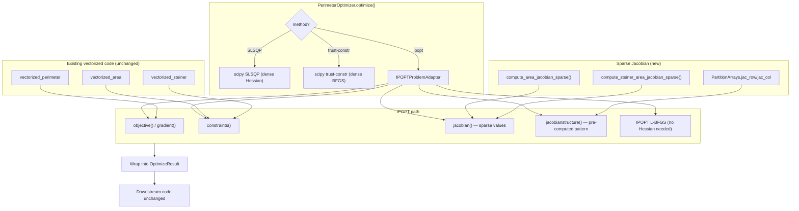

# IPOPT Solver Integration Plan

## Context

SLSQP maintains a dense n x n Hessian (~278 MB for 5,894 VPs), making each iteration ~1,573s. IPOPT in L-BFGS mode uses O(n) storage and O(n) per-iteration Hessian-vector products, which should reduce per-iteration cost by orders of magnitude. The integration must be designed for scaling to thousands of cells and tens of thousands of VPs.

## Key files to modify

- `[src/core/perimeter_optimizer.py](src/core/perimeter_optimizer.py)` — add `ipopt` branch in `optimize()`, adapter class
- `[src/core/vectorized_area.py](src/core/vectorized_area.py)` — add sparse Jacobian function
- `[src/core/vectorized_steiner.py](src/core/vectorized_steiner.py)` — add sparse Steiner Jacobian function
- `[src/core/partition_arrays.py](src/core/partition_arrays.py)` — add pre-computed sparsity pattern arrays
- `[testing/refine_perimeter_iterative.py](testing/refine_perimeter_iterative.py)` — add `ipopt` to `--method` choices

## 1. Sparse Jacobian infrastructure

The constraint Jacobian is `(n_cells-1, n_active_vp)`. At scale (1000 cells, 200k VPs), the dense matrix would be 1.6 GB but only ~0.05% non-zero. The sparsity pattern is fully determined by the partition topology:

- **Regular boundary VPs**: each VP affects exactly 2 cells (the pair on either side of its boundary edge). The non-zero (row, col) pairs come from `btri_cell` / `btri_vp1` / `btri_vp2` in `PartitionArrays`.
- **Triple-point VPs**: each VP affects 3 cells because moving any of the 3 VPs shifts the Steiner point, which changes the void area for all 3 meeting cells. The non-zero pairs come from `tp_contrib_cell` / `tp_contrib_vp1` / `tp_contrib_vp2`.

### Changes to `partition_arrays.py`

Add pre-computed sparsity pattern fields to `PartitionArrays`:

- `jac_row: np.ndarray` — row indices (cell) of all non-zero Jacobian entries
- `jac_col: np.ndarray` — col indices (VP) of all non-zero Jacobian entries

These are built once at `compile_arrays()` time from `btri_`* and `tp_contrib_*` arrays, then passed to IPOPT's `jacobianstructure()`.

### Changes to `vectorized_area.py`

Add `compute_area_jacobian_sparse(pa) -> np.ndarray` that returns only the non-zero values in the order matching `(jac_row, jac_col)`. This replaces the dense `np.zeros((n_c, n_active_vp))` allocation with a 1D values array. The function uses the same analytical derivatives as the existing dense version but scatter-adds into the sparse values array instead.

### Changes to `vectorized_steiner.py`

Add `compute_steiner_area_jacobian_sparse(pa) -> np.ndarray` — same idea. The finite-difference loop over `tp_affected_vps` writes into the sparse values array at the correct offsets. Only the entries corresponding to `tp_contrib_cell` / `tp_contrib_vp1` / `tp_contrib_vp2` are non-zero.

## 2. cyipopt adapter class

Add a class inside `perimeter_optimizer.py` (or a new `src/core/ipopt_adapter.py`) that wraps the existing vectorized evaluation functions into IPOPT's required interface:

```python
class IPOPTProblemAdapter:
    """Wraps PerimeterOptimizer callbacks into cyipopt's interface."""

    def __init__(self, optimizer):
        self._opt = optimizer
        self._pa = optimizer._arrays

    def objective(self, x) -> float:
        return self._opt.objective(x)

    def gradient(self, x) -> np.ndarray:
        return self._opt.objective_gradient(x)

    def constraints(self, x) -> np.ndarray:
        return self._opt.constraint_area_equality(x)

    def jacobian(self, x) -> np.ndarray:
        # Return sparse values in jacobianstructure() order
        regular = compute_area_jacobian_sparse(self._pa)
        steiner = compute_steiner_area_jacobian_sparse(self._pa)
        return regular + steiner

    def jacobianstructure(self) -> tuple:
        return (self._pa.jac_row, self._pa.jac_col)

    # No hessian/hessianstructure — IPOPT uses L-BFGS fallback
```

## 3. Integration into `optimize()`

Add an `elif method == 'ipopt':` branch in `PerimeterOptimizer.optimize()`:

- Import `cyipopt` with a try/except and clear error message if not installed
- Build `IPOPTProblemAdapter` from `self`
- Create `cyipopt.Problem` with `n=n_active_vp`, `m=n_cells-1`, bounds `x_L=0, x_U=1`, constraint bounds `c_L=0, c_U=0`
- Set IPOPT options: `hessian_approximation='limited-memory'`, `max_iter`, `tol`, `print_level`
- Call `problem.solve(lambda0)`
- Wrap result into a scipy-like `OptimizeResult` (map IPOPT status codes to `success`/`message`/`nit`/`nfev`) so downstream code (`get_optimization_info`, `refine_perimeter_iterative.py`) works unchanged

## 4. CLI integration

- In `[testing/refine_perimeter_iterative.py](testing/refine_perimeter_iterative.py)` line 756, add `'ipopt'` to the `--method` choices list
- Same for any other scripts that pass `--method` through to the optimizer

## 5. Dependency handling

- `cyipopt` is an optional dependency — guarded by `try: import cyipopt` at the top of the adapter
- If user passes `--method ipopt` without cyipopt installed, raise a clear error: `"IPOPT requested but cyipopt not installed. Install with: conda install -c conda-forge cyipopt"`
- Do NOT add cyipopt to a hard requirements.txt — document it as optional

## Architecture diagram




## Scaling expectations

- **Memory**: L-BFGS with m=10 history: 10 x n x 8 bytes. For n=200,000 VPs: ~16 MB (vs 320 GB for dense Hessian)
- **Sparse Jacobian**: at most 3 non-zeros per column. For 1000 cells, 200k VPs: ~~600K entries (~~5 MB vs 1.6 GB dense)
- **Per-iteration cost**: O(n) for L-BFGS Hessian-vector products + O(n_btri) for evaluations. Expected 1-5s per iteration even at 5,894 VPs (vs 1,573s with SLSQP)

