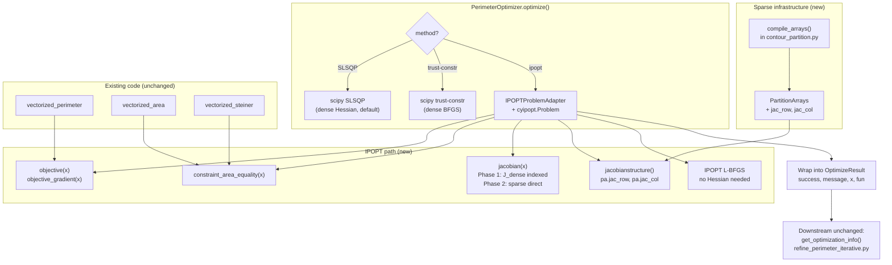

# IPOPT Solver Integration Plan

## 1. Overview and Motivation

### Why SLSQP is the bottleneck

SLSQP (`scipy.optimize.minimize(method='SLSQP')`) is the solver used in
`PerimeterOptimizer`. Profiling from `logs/ring_partition_20260323_221825.log`
(5-cell, 46k-vertex mesh, vectorized evaluation):

```
Iterations:             601
Total optimization:  15,168 s (~4.2 hours)
Avg time/iteration:    25.2 s
```

Estimated per-iteration breakdown:

| Component                  | Time     | Fraction |
|----------------------------|----------|----------|
| SLSQP Fortran QP solver    | ~20–22 s | ~87%     |
| Python/SciPy callbacks     | ~2–3 s   | ~10%     |
| All vectorized evaluations | < 0.05 s | < 0.5%   |

The vectorized code (perimeter, area, Steiner) is essentially free. The bottleneck
is intrinsic to SLSQP's algorithm:

1. **Dense BFGS Hessian**: `n × n` matrix (n = VP count). At n = 5,894: ~278 MB.
2. **Dense QP subproblem** solved at every iteration: O(n²) to O(n³) cost.
3. **Cannot exploit sparsity**: the area constraint Jacobian is sparse (each VP
   affects at most 3 cells) but SLSQP treats it as a dense matrix.

For the 7-cell / 253k-vertex run (`logs/ring_partition_20260325_231508.log`),
n = 5,894 VPs → ~1,573 s/iteration → estimated ~11 days total.

### Why SLSQP does not scale

| VPs (n)  | Hessian memory | QP solve time (est.) | Feasible? |
|----------|----------------|----------------------|-----------|
| 2,000    | 30 MB          | ~20 s                | Slow      |
| 5,000    | 190 MB         | ~300 s               | Barely    |
| 10,000   | 760 MB         | ~2,500 s             | No        |
| 20,000+  | 3+ GB          | out of memory        | No        |

### What IPOPT provides

IPOPT (Interior Point OPTimizer) implements a primal-dual interior-point method:

- Each iteration solves a **single sparse KKT system** (no active-set QP loop).
- Variable bounds `0 ≤ λ ≤ 1` are handled via a log-barrier term (no active-set
  bookkeeping needed).
- **L-BFGS mode**: stores only O(m) vectors (m = history length, typically 10)
  instead of an n × n Hessian. At n = 5,894: ~470 KB vs ~278 MB for SLSQP.
- Exploits Jacobian sparsity natively through its sparse linear solver (MUMPS).

Projected performance for the 5-cell reference problem (1,977 VPs):

| Metric                 | SLSQP (measured) | IPOPT (projected)      |
|------------------------|------------------|------------------------|
| Iterations             | 601              | 50–200                 |
| Per-iteration cost     | ~25 s            | ~0.1–0.5 s             |
| Total optimization     | ~15,000 s (4 h)  | **50–200 s (< 5 min)** |

IPOPT's scaling for larger problems:

| VPs (n)  | KKT factor time (est.) | Total (200 iters) | Feasible? |
|----------|------------------------|-------------------|-----------|
| 2,000    | ~0.1 s                 | ~20 s             | Yes       |
| 10,000   | ~0.5 s                 | ~100 s            | Yes       |
| 50,000   | ~3 s                   | ~600 s            | Yes       |

### Backward compatibility

IPOPT is added as an **optional third method** via `--method ipopt`. The existing
SLSQP path is untouched and remains the default. The interface of `PerimeterOptimizer`
does not change.

---

## 2. Codebase context for the implementing agent

This section gives a new agent the structural knowledge needed to implement this
plan without reading the entire codebase.

### Files to modify

| File | What changes |
|------|-------------|
| `src/core/contour_partition.py` | Add `jac_row`/`jac_col` sparsity arrays at end of `compile_arrays()` |
| `src/core/partition_arrays.py` | Add `jac_row`/`jac_col` fields to `PartitionArrays` dataclass |
| `src/core/perimeter_optimizer.py` | Add `IPOPTProblemAdapter` class and `ipopt` branch in `optimize()` |
| `src/core/vectorized_area.py` | (Phase 2 only) Add `compute_area_jacobian_sparse()` |
| `src/core/vectorized_steiner.py` | (Phase 2 only) Add `compute_steiner_area_jacobian_sparse()` |
| `testing/refine_perimeter_iterative.py` | Add `'ipopt'` to `--method` choices (~line 756) |

> **Note on future restructure**: a separate codebase restructure plan
> (`docs/CODEBASE_RESTRUCTURE_PLAN.md`) will move these files to new subpackages
> (`src/optimization/`, `src/partition/`, etc.). The IPOPT integration should be
> implemented first on the current paths, and the restructure will move the files
> afterwards. Do not restructure and implement IPOPT in the same session.

### How the vectorized evaluation path works

During optimization, `PerimeterOptimizer.compile()` (line 151) calls
`self.partition.compile_arrays(self.steiner_handler)`, which is defined at line
1006 of `contour_partition.py`. This method walks the object-oriented partition
structures once and returns a `PartitionArrays` snapshot — a frozen set of flat
NumPy arrays that represents the partition topology for the current iteration.

`PartitionArrays` is a `@dataclass` defined in `src/core/partition_arrays.py`. The
optimizer stores it as `self._arrays`. All four callbacks (`objective`,
`objective_gradient`, `constraint_area_equality`, `constraint_area_jacobian`) check
`if self._arrays is not None:` to decide whether to use the fast vectorized path.

**The IPOPT path requires `_arrays is not None`** (i.e., `use_vectorized=True`,
which is the default). If the user passes `--no-vectorized`, raise a clear error:
`"IPOPT requires vectorized evaluation. Remove --no-vectorized or use --method SLSQP."`

### Active VP mapping

After migrations, some VPs become inactive. The optimizer maintains:

- `self._n_active`: number of active VPs
- `self._n_total`: total VP count including inactive
- `self._active_indices`: absolute indices of active VPs
- `self._use_active_mapping`: True when inactive VPs exist

IPOPT receives `n = self._n_active` variables (active VPs only). After IPOPT solves,
the result vector is in active-index space and must be expanded before syncing:

```python
full_result = self._to_full(x_opt)   # expand active → full
self.partition.set_variable_vector(full_result)
```

This mirrors exactly what the SLSQP path does at lines 385–390 of
`perimeter_optimizer.py`.

### The constraint formulation

`constraint_area_equality(x)` returns `areas[:-1] - self.target_area`, shape
`(n_cells - 1,)`. This means the constraint is satisfied when the return value is
zero.

**For IPOPT**, the constraint bounds must therefore be:

```python
cl = np.zeros(self.partition.n_cells - 1)   # lower bound = 0
cu = np.zeros(self.partition.n_cells - 1)   # upper bound = 0
```

**Do NOT use `cl = cu = target_areas`** — that would mean the constraint is satisfied
when `areas = 2 * target_area`, which is incorrect.

### Result wrapping

`cyipopt.Problem.solve(x0)` returns `(x_opt, info)` where `info` is a dict:

| Key | Content |
|-----|---------|
| `status` | Integer: 0 = Solve_Succeeded, 1 = Solved_To_Acceptable_Level, -1 = Maximum_Iterations_Exceeded, others = failure |
| `status_msg` | Human-readable status string (bytes or str) |
| `obj_val` | Final objective value |
| `g` | Final constraint values |

IPOPT does not directly return `nit` or `nfev` in the info dict. Downstream code
(`get_optimization_info()`, `refine_perimeter_iterative.py`) accesses `result.success`,
`result.message`, `result.nit`, `result.nfev`. Build a compatible result object using
`scipy.optimize.OptimizeResult`:

```python
from scipy.optimize import OptimizeResult

status = info['status']
success = status in (0, 1)
msg = info.get('status_msg', '')
if isinstance(msg, bytes):
    msg = msg.decode()

result = OptimizeResult(
    x=x_opt,
    success=success,
    message=msg,
    fun=info['obj_val'],
    nit=-1,    # IPOPT does not expose this easily; -1 signals "not tracked"
    nfev=-1,
    status=status,
)
```

`get_optimization_info()` logs `result.nit` and `result.nfev` — the `-1` values
will appear in the log as `Iterations: -1`, which is acceptable for now.

### Callback and iteration logging

The current `_callback(self, *args, **kwargs)` is designed for scipy solvers. For
IPOPT, do not pass this callback to `cyipopt.Problem`. Instead, control IPOPT's
verbosity via the `print_level` option:

- `print_level=0`: silent (all IPOPT output suppressed)
- `print_level=3`: concise (recommended; prints summary per major iteration)
- `print_level=5`: default verbose

IPOPT with `print_level=3` will print a line per iteration to stdout, which will
appear in the log. The existing `_callback`-based `Iteration N: Perimeter=...`
logging at every 10 iterations will not work for IPOPT — that is acceptable.

---

## 3. Installation

**cyipopt is already installed in this project's pyenv environment.** The
implementing agent should verify with:

```bash
python -c "import cyipopt; print('cyipopt', cyipopt.__version__)"
```

If it is not available (e.g., in a fresh environment), installation depends on
whether a pre-built wheel exists for the active Python version:

- **Python 3.10+**: `pip install cyipopt` usually works directly (binary wheel).
- **Python 3.9 and older**: No wheel is available; pip tries to compile from
  source. This requires the IPOPT C library installed system-wide first:
  ```bash
  brew install pkg-config ipopt    # macOS (Homebrew)
  pip install cyipopt
  ```
- **Conda alternative** (handles all dependencies automatically):
  ```bash
  conda install -c conda-forge cyipopt
  ```

`cyipopt` must be treated as an **optional dependency**. Import it inside a
`try/except` block and raise a clear error if missing:

```python
try:
    import cyipopt
except ImportError:
    raise ImportError(
        "IPOPT requested but cyipopt is not installed.\n"
        "Install with: pip install cyipopt"
    )
```

Do NOT add `cyipopt` to `requirements.txt` or `pyproject.toml` as a required
dependency.

---

## 4. Implementation plan

### Phase 1: Get IPOPT working (minimal changes)

This phase gets a working IPOPT solver with no new vectorized infrastructure.
The constraint Jacobian is computed as a dense matrix and sparse values are
extracted by indexing. This is fast enough for the current scale and avoids
the complexity of Phase 2.

**Step 1: Add sparsity pattern to `PartitionArrays`**

In `src/core/partition_arrays.py`, add two new fields to the `PartitionArrays`
dataclass:

```python
# Sparse Jacobian structure for IPOPT
jac_row: np.ndarray   # int32 (nnz,) — row (cell) index of each non-zero
jac_col: np.ndarray   # int32 (nnz,) — col (VP) index of each non-zero
```

**Step 2: Build the sparsity pattern in `compile_arrays()`**

At the end of `PartitionContour.compile_arrays()` in `contour_partition.py`
(currently lines 1186–1215, right before the `return PartitionArrays(...)` call),
add the sparsity pattern computation and include the new fields in the returned
dataclass.

The sparsity pattern identifies all `(cell, vp)` pairs where the Jacobian entry
is potentially non-zero. The constraint covers cells `0` through `n_cells - 2`
(last cell is unconstrained by conservation).

Sources of non-zeros:
- **Regular boundary triangles**: `btri_cell, btri_vp1, btri_vp2` — each row
  contributes `(btri_cell[i], btri_vp1[i])` and `(btri_cell[i], btri_vp2[i])`.
- **Triple-point contributions**: `tp_contrib_cell, tp_contrib_vp1, tp_contrib_vp2`
  — each row contributes `(tp_contrib_cell[i], tp_contrib_vp1[i])` and
  `(tp_contrib_cell[i], tp_contrib_vp2[i])`.

**IMPORTANT — triple-point coupling is 3×3, not 2-per-cell**: each of the 3
VPs at a triple point affects ALL 3 meeting cells, because moving ANY VP shifts
the Steiner point, which changes the void area for all 3 cells. The
`tp_contrib_cell/vp1/vp2` arrays only record the 2 VPs that form each cell's
boundary within the triple point — but the THIRD VP also has a non-zero Jacobian
entry for that cell. Therefore, the sparsity pattern must enumerate all 9
`(cell, vp)` combinations per triple point (3 cells × 3 VPs), not just 6.

Use `tp_vp_indices` (shape `(n_tp, 3)`) to get all 3 VPs per triple point, and
`tp_contrib_cell` / `tp_contrib_tp_idx` to get the 3 cells per triple point.

All the local variables below (`btri_cell`, `btri_vp1`, `tp_vp_indices`,
`tp_contrib_tp_idx`, `tp_contrib_cell`, `n_tp`, `n_btri`, etc.) are already in
scope at this point in `compile_arrays()`.

```python
n_constrained = self.n_cells - 1  # only cells 0..n_cells-2 are constrained

# Regular boundary contributions
if n_btri > 0:
    btri_mask = btri_cell < n_constrained
    rows_reg = np.concatenate([btri_cell[btri_mask], btri_cell[btri_mask]])
    cols_reg = np.concatenate([btri_vp1[btri_mask], btri_vp2[btri_mask]])
else:
    rows_reg = np.empty(0, dtype=np.int32)
    cols_reg = np.empty(0, dtype=np.int32)

# Triple-point contributions: ALL 3 VPs × ALL 3 cells per triple point
if n_tp > 0:
    tp_rows_l, tp_cols_l = [], []
    for tp_i in range(n_tp):
        vps_i = tp_vp_indices[tp_i]                       # 3 VPs
        cells_i = tp_contrib_cell[tp_contrib_tp_idx == tp_i]  # 3 cells
        for c in cells_i:
            if c < n_constrained:
                for v in vps_i:
                    tp_rows_l.append(c)
                    tp_cols_l.append(v)
    rows_tp = np.array(tp_rows_l, dtype=np.int32) if tp_rows_l else np.empty(0, dtype=np.int32)
    cols_tp = np.array(tp_cols_l, dtype=np.int32) if tp_cols_l else np.empty(0, dtype=np.int32)
else:
    rows_tp = np.empty(0, dtype=np.int32)
    cols_tp = np.empty(0, dtype=np.int32)

all_rows = np.concatenate([rows_reg, rows_tp])
all_cols = np.concatenate([cols_reg, cols_tp])

# Deduplicate (a VP can appear in multiple triangles for the same cell)
if len(all_rows) > 0:
    pairs = np.unique(
        np.stack([all_rows, all_cols], axis=1), axis=0
    )
    jac_row = pairs[:, 0].astype(np.int32)
    jac_col = pairs[:, 1].astype(np.int32)
else:
    jac_row = np.empty(0, dtype=np.int32)
    jac_col = np.empty(0, dtype=np.int32)
```

**Step 3: Create `IPOPTProblemAdapter` in `perimeter_optimizer.py`**

Add this class just above the `PerimeterOptimizer` class definition:

```python
class IPOPTProblemAdapter:
    """Wraps PerimeterOptimizer callbacks into the cyipopt problem interface.

    cyipopt requires a class with specific method names (objective, gradient,
    constraints, jacobian, jacobianstructure). This adapter delegates to the
    existing PerimeterOptimizer methods, which handle the active/inactive VP
    mapping internally.
    """

    def __init__(self, optimizer: 'PerimeterOptimizer'):
        self._opt = optimizer
        self._pa = optimizer._arrays   # PartitionArrays snapshot

    def objective(self, x: np.ndarray) -> float:
        return self._opt.objective(x)

    def gradient(self, x: np.ndarray) -> np.ndarray:
        return self._opt.objective_gradient(x)

    def constraints(self, x: np.ndarray) -> np.ndarray:
        return self._opt.constraint_area_equality(x)

    def jacobianstructure(self) -> tuple:
        """Pre-computed sparsity pattern — called once at setup."""
        return (self._pa.jac_row, self._pa.jac_col)

    def jacobian(self, x: np.ndarray) -> np.ndarray:
        """Return non-zero Jacobian values in jacobianstructure() order.

        Phase 1: compute the dense Jacobian and extract non-zeros by indexing.
        This is correct and fast enough at current scale. Phase 2 will replace
        this with a direct sparse computation.
        """
        J_dense = self._opt.constraint_area_jacobian(x)   # (n_cells-1, n_vp)
        return J_dense[self._pa.jac_row, self._pa.jac_col]

    # hessian() and hessianstructure() are intentionally omitted.
    # IPOPT falls back to L-BFGS, which is the desired behaviour.

    def intermediate(self, alg_mod, iter_count, obj_value,
                     inf_pr, inf_du, mu, d_norm,
                     regularization_size, alpha_du, alpha_pr, ls_trials):
        """Called by IPOPT after each iteration. Log progress."""
        import logging
        logger = logging.getLogger(__name__)
        if iter_count % 10 == 0:
            logger.info(f"IPOPT iter {iter_count}: obj={obj_value:.6f}, "
                        f"constr_viol={inf_pr:.2e}")
        return True
```

> **IMPORTANT — Phase 1 scaling limitation**: The `jacobian()` method above
> allocates a dense `(n_cells-1, n_active_vp)` matrix every call. At the current
> scale (< 50 cells) this is negligible. At thousands of cells (e.g., 1000 cells ×
> 50,000 VPs = 400 MB per call), this becomes the new bottleneck. Phase 2 eliminates
> this allocation entirely. **The implementing agent must add a runtime warning**
> inside `jacobian()` when the dense matrix exceeds a threshold:
>
> ```python
> def jacobian(self, x):
>     J_dense = self._opt.constraint_area_jacobian(x)
>     dense_mb = J_dense.nbytes / 1e6
>     if dense_mb > 50:
>         import warnings
>         warnings.warn(
>             f"IPOPT Jacobian: dense matrix is {dense_mb:.0f} MB. "
>             f"Implement Phase 2 (sparse Jacobian) for better scaling. "
>             f"See docs/IPOPT_INTEGRATION_PLAN.md, Section 4, Phase 2.",
>             stacklevel=2,
>         )
>     return J_dense[self._pa.jac_row, self._pa.jac_col]
> ```

**Step 4: Add the `ipopt` branch in `optimize()`**

The current code structure in `optimize()` (lines 357–406) is:

```python
start_time = time.time()                         # line 358

if method == 'SLSQP':                            # line 361
    options = {...}
elif method == 'trust-constr':                    # line 363
    options = {...}
else:                                             # line 367
    options = {...}

result = minimize(...)                            # line 371 — ALWAYS runs
elapsed_time = time.time() - start_time           # line 382
# ... sync + logging ...                          # lines 384–406
```

**The IPOPT branch must bypass the `minimize()` call entirely.** Restructure
the block so that `minimize()` only runs for scipy methods, and IPOPT sets
`result` and `elapsed_time` independently. The cleanest refactor is:

```python
start_time = time.time()

if method == 'ipopt':
    # ---- IPOPT path (does NOT call scipy minimize) ----
    try:
        import cyipopt
    except ImportError:
        raise ImportError(
            "IPOPT requested but cyipopt is not installed.\n"
            "Install with: pip install cyipopt"
        )

    if self._arrays is None:
        raise RuntimeError(
            "IPOPT requires vectorized evaluation. "
            "Do not pass --no-vectorized when using --method ipopt."
        )

    n = len(lambda0)
    m = self.partition.n_cells - 1

    adapter = IPOPTProblemAdapter(self)

    problem = cyipopt.Problem(
        n=n,
        m=m,
        problem_obj=adapter,
        lb=np.zeros(n),
        ub=np.ones(n),
        cl=np.zeros(m),
        cu=np.zeros(m),
    )

    problem.add_option('hessian_approximation', 'limited-memory')
    problem.add_option('mu_strategy', 'adaptive')
    problem.add_option('tol', tol)
    problem.add_option('acceptable_tol', tol * 100)
    problem.add_option('max_iter', max_iter)
    problem.add_option('print_level', 3)

    x_opt, info = problem.solve(lambda0)

    ipopt_status = info['status']
    success = ipopt_status in (0, 1)
    msg = info.get('status_msg', '')
    if isinstance(msg, bytes):
        msg = msg.decode()

    result = OptimizeResult(
        x=x_opt,
        success=success,
        message=msg,
        fun=info['obj_val'],
        nit=-1,
        nfev=-1,
        status=ipopt_status,
    )

else:
    # ---- scipy path (SLSQP / trust-constr) ----
    if method == 'SLSQP':
        options = {'maxiter': max_iter, 'ftol': tol, 'disp': True}
    elif method == 'trust-constr':
        options = {'maxiter': max_iter, 'gtol': tol, 'xtol': tol, 'disp': True}
    else:
        options = {'maxiter': max_iter, 'disp': True}

    result = minimize(
        fun=self.objective,
        x0=lambda0,
        method=method,
        jac=self.objective_gradient,
        bounds=bounds,
        constraints=constraints,
        callback=self._callback,
        options=options,
    )

elapsed_time = time.time() - start_time

# Sync + logging (shared by ALL methods — unchanged from current code)
if self._arrays is not None:
    full_result = self._to_full(result.x)
    self.partition.set_variable_vector(full_result)
else:
    self.partition.set_variable_vector(result.x)

final_obj = self.objective(result.x)
# ... rest of logging block unchanged ...
```

Note that `start_time` (already at line 358) stays before the branching, and
`elapsed_time` stays after. The sync and logging blocks (lines 384–406) are
shared by all methods and remain unchanged — they only depend on `result`,
which both branches set.

**Step 5: Add `'ipopt'` to CLI choices**

In `testing/refine_perimeter_iterative.py` around line 756:

```python
parser.add_argument('--method', type=str, default='SLSQP',
                    choices=['SLSQP', 'trust-constr', 'ipopt'],
                    help='Optimization method (default: SLSQP)')
```

> Note: `examples/refine_perimeter.py` is a legacy script being replaced by
> `testing/refine_perimeter_iterative.py`. Do not modify it.

---

### Phase 2: Sparse Jacobian (avoids dense matrix allocation)

> **This phase is REQUIRED before scaling to thousands of cells.** Phase 1's
> `jacobian()` method emits a runtime warning when the dense matrix exceeds 50 MB
> — that warning is the signal to implement this phase.

Phase 1 allocates a full `(n_cells-1, n_active_vp)` dense matrix just to index
into it. At scale with thousands of cells and 200k VPs, this is 1.6 GB — infeasible.

Phase 2 replaces the `jacobian()` method in `IPOPTProblemAdapter` with a function
that builds the sparse values directly, without ever allocating the dense matrix.

**`compute_area_jacobian_sparse(pa)` in `vectorized_area.py`**

Signature:
```python
def compute_area_jacobian_sparse(pa: PartitionArrays) -> np.ndarray:
    """Compute non-zero values of the area Jacobian in jac_row/jac_col order.

    Returns:
        (nnz,) float64 — values at positions (pa.jac_row, pa.jac_col).
    """
```

Implementation strategy: mirror `compute_area_jacobian_analytical()` but write
into a 1D values array at offsets determined by `np.searchsorted(pa.jac_col, ...)` 
or a pre-built lookup from `(row, col)` → offset index. The pre-built lookup is
most efficient and should be stored in `PartitionArrays` alongside `jac_row/jac_col`.

**`compute_steiner_area_jacobian_sparse(pa)` in `vectorized_steiner.py`**

Same approach for the Steiner contribution. Only VPs in `tp_affected_vps` have
non-zero Steiner Jacobian entries, and only in the 3 cells at each triple point.

Phase 2 can be deferred until the problem size makes the dense allocation expensive.
For the current 7-cell case (6 × 5,894 = ~280 KB dense matrix), Phase 1 is
completely fine.

---

### Phase 3: Validation

After implementing Phase 1:

1. Run SLSQP and IPOPT from **identical starting points** on the 5-cell reference
   mesh (the smaller mesh that completes in reasonable time with SLSQP).
2. Verify final perimeter values agree to within `1e-4` absolute.
3. Verify max area constraint violation `< 1e-6` for both.
4. Compare convergence trajectory: perimeter vs. iteration count.

Use `examples/optimization_analyzer.py` to compare the output `.h5` files.

---

### Phase 4 (optional): Exact Hessian

L-BFGS uses a limited-memory approximation to the Lagrangian Hessian. If IPOPT
with L-BFGS requires too many iterations to converge, the exact Hessian can be
provided. The perimeter contribution to the Hessian is:

```
d²(||p1 - p2||) / d(λ_i) d(λ_j)
```

This is non-zero for VPs sharing a segment (the Hessian of a Euclidean norm is not
zero — the perimeter is NOT linear in λ). The sparsity structure of the Hessian
matches that of the Jacobian (same `(row, col)` pairs, but symmetric and square in
VP space). Only implement this if L-BFGS convergence is unsatisfactory.

---

## 5. Architecture summary



---

## 6. Correctness checklist for the implementing agent

Before committing:

- [ ] `cl = cu = np.zeros(m)` — NOT `target_areas`
- [ ] `n = len(lambda0)` which equals `self._n_active` (active VPs only, not `_n_total`)
- [ ] `full_result = self._to_full(result.x)` before `set_variable_vector()`
- [ ] `jac_row/jac_col` contain only cells `0..n_cells-2` (last cell excluded)
- [ ] `jac_row/jac_col` pairs are deduplicated (a VP can appear in multiple triangles)
- [ ] Triple-point sparsity uses ALL 3 VPs × ALL 3 cells (9 entries per TP, not 6)
- [ ] `jacobian(x)` returns values in exactly the same order as `jacobianstructure()`
- [ ] `minimize()` is NOT called when `method == 'ipopt'` (IPOPT has its own solve)
- [ ] IPOPT branch raises a clear error if `self._arrays is None`
- [ ] `cyipopt` import is guarded by `try/except ImportError`
- [ ] `cyipopt` is NOT added to `requirements.txt` or `pyproject.toml`
- [ ] `optimize()` docstring updated to mention `'ipopt'` as a valid method

---

## 7. References

- IPOPT paper: Wächter, A. & Biegler, L.T. (2006). "On the implementation of an
  interior-point filter line-search algorithm for large-scale nonlinear programming."
  *Mathematical Programming*, 106(1), 25–57.
- cyipopt documentation: https://cyipopt.readthedocs.io/
- cyipopt source: https://github.com/mechmotum/cyipopt
