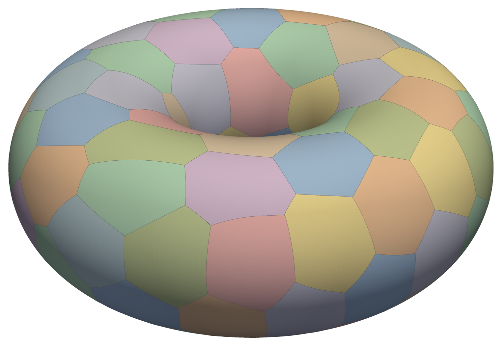
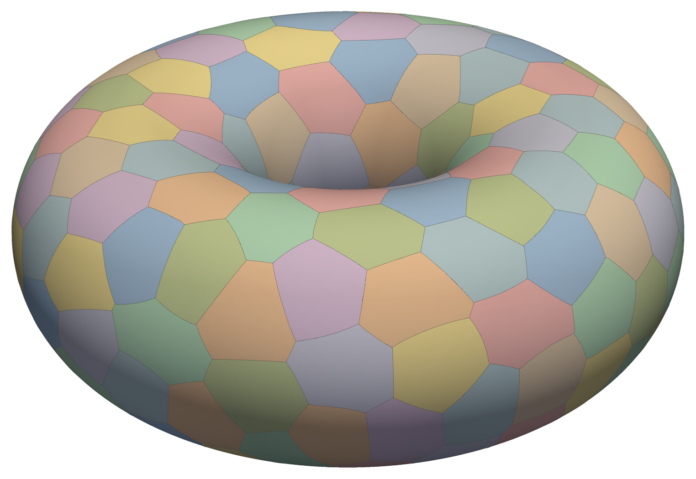
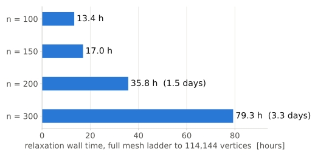
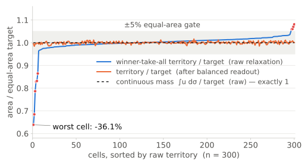
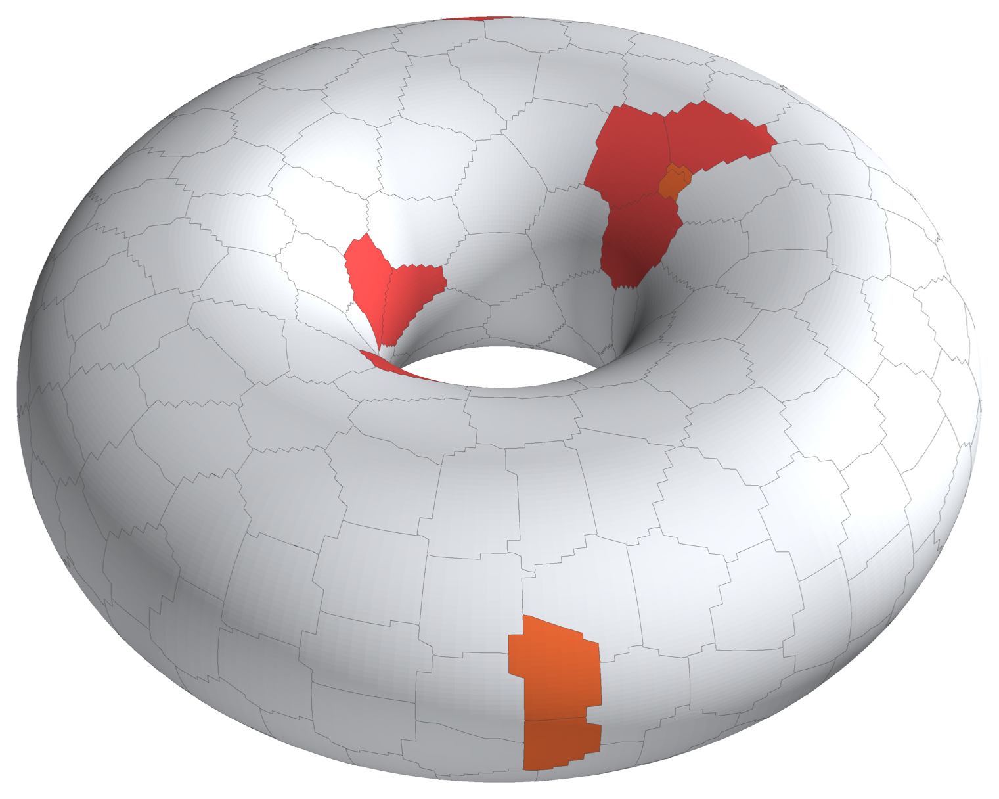
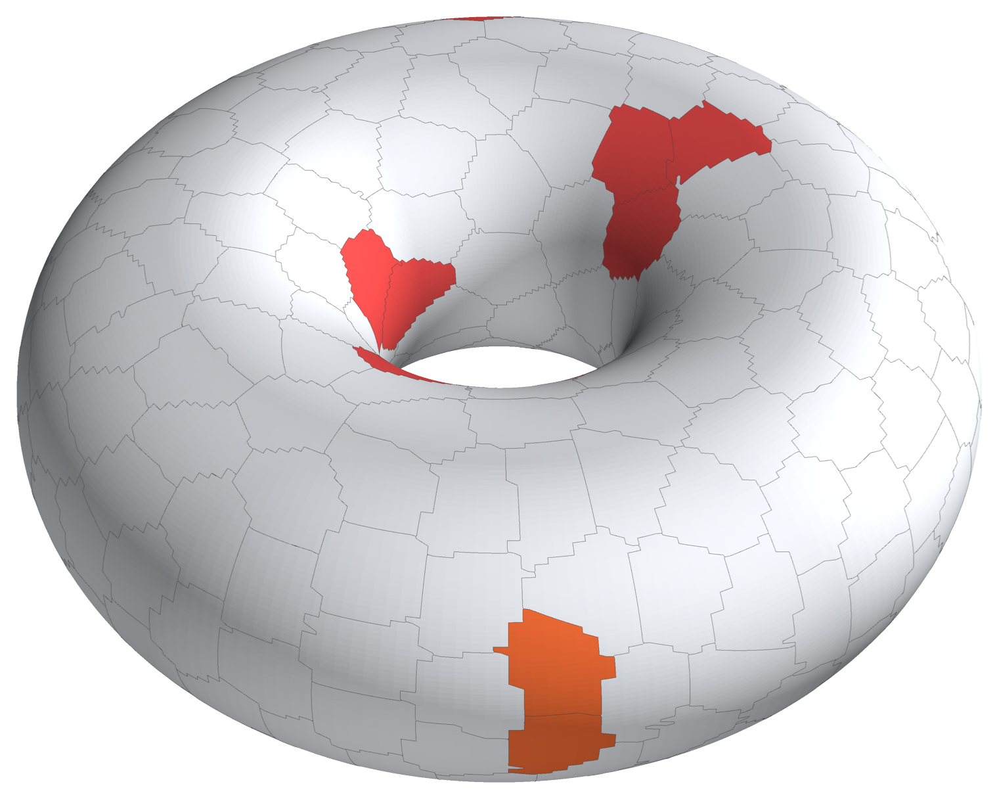

<!-- _class: title -->
<!-- _footer: '' -->
# Minimal-perimeter partitions on surfaces

## Esteban Velez

> ### Status brief
> The relaxation pipeline, its limits, and the fix that reaches 300 cells

## Draft, 2026-09-16

---
<!-- header: 'What we compute' -->

###### n = 100 cells on a torus with 114,144 mesh vertices, after the contour optimisation.

- A surface $S \subset \mathbb{R}^3$ and a partition $(\omega_i)_{i=1}^n$ of $S$ into $n$ cells of prescribed area $|\omega_i| = c_i = |S|/n$.
- Minimise the total geodesic perimeter (Bogosel & Oudet):
  $$\operatorname{Per}(\omega_1) + \cdots + \operatorname{Per}(\omega_n).$$
- Working surface: the torus with $R = 1$, $r = 0.6$, triangulated at up to 114,144 vertices.
- Two phases, as in the paper: a **relaxed** problem on densities, solved on a ladder of finer meshes; then the extracted **contours** optimised directly under exact area constraints.

---
<!-- header: 'The relaxed problem' -->

$$
F_\varepsilon(\mathbf{u}) \;=\; \sum_{i=1}^{n} \int_S \Big( \varepsilon\,|\nabla_\tau u_i|^2 \;+\; \frac{1}{\varepsilon}\, u_i^2 (1-u_i)^2 \Big)\, d\sigma,
\qquad
\mathbf{u} \in X = \Big\{ \textstyle\int_S u_i = c_i,\;\; \sum_{i=1}^{n} u_i = 1 \Big\}
$$

- One density $u_i : S \to [0,1]$ per cell. **Gradient term:** an interface costs $\varepsilon\,|\nabla_\tau u_i|^2$, so transitions spread over a width $\sim\varepsilon$ and short interfaces are cheap. **Potential term:** the double well $u_i^2(1-u_i)^2$ is zero only at $0$ and $1$, so away from interfaces $u_i$ is pushed to $\{0,1\}$.
- **Γ-convergence** (Theorem 2.2): as $\varepsilon \to 0$, $F_\varepsilon \;\xrightarrow{\;\Gamma\;}\; \tfrac{1}{3}\sum_i \operatorname{Per}(\{u_i = 1\})$, so minimisers of $F_\varepsilon$ on $X$ approach minimal-perimeter partitions with the prescribed areas.
- $\varepsilon$ must be of the order of the mesh size — smaller and the gradient term sees nothing. Hence the **mesh ladder**: decrease $\varepsilon$ with each refinement, interpolating the previous densities as the starting point.

> #### Constraints
> $X$ carries the two constraints the partition needs: **equal areas** $\int_S u_i = |S|/n$ and the **partition of unity** $\sum_i u_i = 1$ at every point. Both are imposed exactly, by orthogonal projection after every gradient step.

---
<!-- header: 'Finite elements: the three terms and their gradients' -->
<!-- _class: compact -->

Mesh with $N$ vertices; $P_1$ mass and stiffness matrices $M$, $K$; nodal values $\varphi^i \in \mathbb{R}^N$ of $u_i$; lumped mass $v = \mathbf{1}^{\top} M$, so $\langle v, \varphi^i \rangle \approx \int_S u_i$; $A = |S|$; $\odot$ = component-wise product.

| term | discrete energy, per cell $i$ | gradient w.r.t. $\varphi^i$ | role |
|---|---|---|---|
| **gradient** | $\varepsilon\, (\varphi^i)^{\top} K\, \varphi^i$ | $2\varepsilon\, K \varphi^i$ | short interfaces |
| **potential** | $\dfrac{1}{\varepsilon}\, (w^i)^{\top} M\, w^i, \qquad w^i = \varphi^i \odot (1 - \varphi^i)$ | $\dfrac{2}{\varepsilon}\, (1 - 2\varphi^i) \odot M w^i$ | crisp $0/1$ values |
| **penalty** | $\lambda \Big( 1 - \operatorname{Var}_v(\varphi^i) \big/ T \Big)$ | $-\dfrac{2\lambda}{A\,T}\; v \odot (\varphi^i - \mu)$ | penalises a diffuse $\varphi^i$ |

$\operatorname{Var}_v(\varphi^i) = \frac{1}{A}\sum_k v_k (\varphi^i_k - \mu)^2$ with $\mu = \langle v, \varphi^i \rangle / A = 1/n$, and $T = \frac{1}{n}\big(1 - \frac{1}{n}\big)$ is the variance of a sharp indicator of area $A/n$ — so the penalty vanishes for a crisp cell: the paper's $\lambda\,(\operatorname{std}(\varphi^i) - s_{\text{target}})^2$, normalised. The energy is the sum of the three rows over $i = 1, \dots, n$.

- **Constraints on** $\Phi = (\varphi^1 \cdots \varphi^n) \in \mathbb{R}^{N \times n}$: every row sums to $1$ (partition of unity), $\langle v, \varphi^i \rangle = A/n$ for every column (equal areas); orthogonal projection onto both after each gradient step (the paper's Algorithm 1). $\varepsilon = \sqrt{\text{mean triangle area}} \approx h$.
- The paper's text has $w = \varphi^{.2} \odot (1-\varphi)^{.2}$, i.e. $\int u^4(1-u)^4$; we use $w = \varphi \odot (1-\varphi)$, which is the $\int u^2(1-u)^2$ of $F_\varepsilon$.

---
<!-- header: 'From densities to a partition: winner-take-all, then contour optimisation' -->

###### n = 200 on the same mesh, after contour optimisation. Lines: the optimised contours.

- **Readout (paper's 5.1).** $\phi_i(x) = 1$ if $u_i(x) \ge \max_{j \ne i} u_j(x)$, else $0$: every vertex goes to the cell with the largest density. That hard labelling *is* the partition.
- **Contours.** The 0.5 level sets of the $\phi_i$ cross mesh edges at *variable points* $x_i = \lambda_i v_1 + (1-\lambda_i) v_2$, $\lambda_i \in [0,1]$; the void at each triple point is closed by a Steiner tree through the Fermat point.
- **Optimisation.** Minimise $\sum_i \operatorname{Per}(\omega_i)$ over the $\lambda_i$ with exact equal-area constraints (interior point, analytical derivatives). When a $\lambda_i$ reaches $0$ or $1$, or a Fermat point leaves its triangle, the contour is rebuilt and the optimisation restarts.
- **Three validity checks on the readout, before the contour stage:** no empty cell; every cell within ±5 % of equal area; every cell connected.

---
<!-- header: 'Where it works: n = 100 → 200 on the same mesh' -->
<!-- _class: compact -->

| n | λ | relaxation wall | empty | imbalanced | fragmented | worst cell | final perimeter |
|--:|--:|--:|--:|--:|--:|--:|--:|
| 100 | 5.1 | 13.4 h | 0 | 0 | 0 | 0.78 % | 185.25 |
| 150 | 6.0 | 17.0 h | 0 | 0 | 0 | 1.24 % | 228.16 |
| 200 | 11.0 | 35.8 h | 0 | 0 | 0 | 1.65 % | 262.11 |

All three checks pass on the raw readout. "Worst cell" is the largest deviation from equal area *before* the contour stage, which then equalises the areas to solver tolerance.

**What it took — the practical problems with the relaxation:**

- **Seeded initialisation is mandatory.** From random densities the energy traps in the symmetric diffuse state (n = 30: 43 % worst-cell error vs 0.7 % seeded). We start from Voronoi cells of well-spread seed vertices.
- **λ has a working window that moves with n** (≈ 5 at n = 100, ≈ 11 at n = 200). Too low: diffuse "runt" cells. Too high: the penalty dominates, levels stop early, interfaces never crisp.
- **Some failures are seed-specific.** n = 200 was unblocked by changing the seed. A run is one trajectory, not a statistic.

---
<!-- header: 'What it costs' -->

###### Full 5-level ladder, one process on a Mac mini (M-series).

- Grows much faster than n: **×2.7** from n = 100 to 200, **×2.2** again to 300.
- **93 % of the relaxation is the projection** onto the two constraints — an alternating projection, ~46 inner iterations per gradient step at n = 300.
- Part is waste: at n = 100 the coarsest level runs to its 30,000-iteration cap with labels frozen from iteration ~6,000 (32 % of that ladder). A structure-based stop reclaims it (13.4 h → 9.7 h) but does not change the trend.
- The contour stage is 30–40 min at these n. The relaxation is the cost.

---
<!-- _class: divider -->
<!-- _header: '' -->
# What goes wrong as n grows

## Three artefacts of the winner-take-all readout, and why

---
<!-- header: 'Three artefacts, one cause' -->
<!-- _class: compact -->

| | **Empty cell** | **Runt cell** | **Split cell** |
|---|---|---|---|
| territory after readout | **zero** — wins no vertex | well below target (−36 % at n = 300) | right total, in **2+ disconnected islands** |
| peak density | low (~0.1), never a winner | **1.0** — a confident winner on a small core | **1.0** in every piece |
| what breaks | wrong cell **count** | unequal **areas** → contour stage infeasible at iteration 0 | non-physical topology → multi-loop contours |
| caught by | empty-cell check | area check | connectivity check only |
| status | **resolved** — seeded init | resolved to n = 200 (corrected well + moderate λ); **back at n = 300** | from n ≈ 200 (3/200 on one seed, 2/300); rare, never zero |

Each is a perfectly consistent **minimiser of** $F_\varepsilon$ — and not a valid $n$-cell partition. The checks catch them; nothing in the relaxation prevents them.

---
<!-- header: 'Why: the energy controls mass, the readout takes territory' -->

###### n = 300 on a 47,488-vertex mesh: raw relaxation and its balanced readout.

- The area constraint fixes the **continuous mass** $\int_S u_i = |S|/n$ exactly — "equal paint". The readout (5.1) awards **territory** by the maximum. Nothing in $F_\varepsilon$ or in $X$ refers to that maximum.
- A healthy cell — $u_i \approx 1$ on a compact blob — has the two agree. A cell that spreads its paint into the diffuse band between cells keeps its mass and **loses territory**: the runt.
- Nothing penalises a cell in two pieces, and equal mass is **non-local**: a cell can buy area far from its core. Fragmentation is born mid-level, while the imbalance is being reduced.
- The levers that work at moderate n — seeded init, the corrected well, λ — run out at n = 300: λ has a ceiling above which interfaces never crisp.

---
<!-- header: 'Seen at n = 300' -->
<!-- _class: compact -->

###### Raw readout, 47,488 vertices, before the contour stage. Red: outside the ±5 % area check; orange: fragmented (one stray piece sits beside the red cells).

| mesh vertices | relaxation | empty | imbalanced (worst) | split |
|--:|--:|--:|--:|--:|
| 47,488 | 22.0 h | 0 | **10** (−36.1 %) | **2** |
| 114,144 | +57.3 h | 0 | **3** (−24.8 %) | **2** |

- Same λ = 11.5 and seed. The finer mesh **reduces** the imbalance, does not remove it; the split cells survive it.
- The contour stage cannot start here: the worst cell's deficit *is* the equal-area violation at iteration 0, and the optimiser stalls infeasible.
- The two coarse levels did no work (32 and 83 vertices per cell — the line search floors within ~60 iterations); level 2 did all of it.

---
<!-- header: 'The fix: a balanced readout, at extraction time' -->

###### The same cells after the balanced readout: all within ±1.63 % of equal area, all connected.

- Leave $F_\varepsilon$ alone; fix the **readout**. Replace $\arg\max_i u_i$ by $\arg\max_i\,[\log u_i + \psi_i]$: $n$ per-cell offsets solved so every cell's territory hits $|S|/n$ — the dual of an optimal-transport assignment. Raising $\psi_i$ grows cell $i$ from its own core, so the correction is **local**.
- Then **connectivity repair**: a stray piece joins the neighbour with the longest shared boundary; equal areas are restored by single-vertex transfers that never disconnect a cell.
- **n = 300, 47k vertices:** 10 imbalanced / −36.1 % / 2 fragmented → offsets: 0 / 2 → repair: **0 / 1.63 % / 0**, in ~17 s. 1,840 vertices relabelled, boundary +1.9 %.
- Same file format, so the contour stage runs unchanged: **323.32** (47k), **322.96** (114k).

---
<!-- header: 'Where we stand' -->

| n | mesh vertices | route | worst cell | final perimeter |
|--:|--:|---|--:|--:|
| 100 | 114,144 | raw relaxation | 0.78 % | 185.25 |
| 150 | 114,144 | raw relaxation | 1.24 % | 228.16 |
| 200 | 114,144 | raw relaxation | 1.65 % | 262.11 |
| 300 | 114,144 | relaxation + balanced readout | 0.64 % | 322.96 |

- **Valid, equal-area, connected partitions for n = 100, 150, 200 and 300 on one common mesh**, exported for downstream use.
- The balanced readout closes the winner-take-all gap **at any n, in seconds** — that part is solved.
- **The relaxation itself is the open problem:** 79 h at n = 300, rising faster than linearly, and its raw partition already needs repair. Going past 300 cells means changing how the relaxation arrives at a labelling — that is the next conversation.
