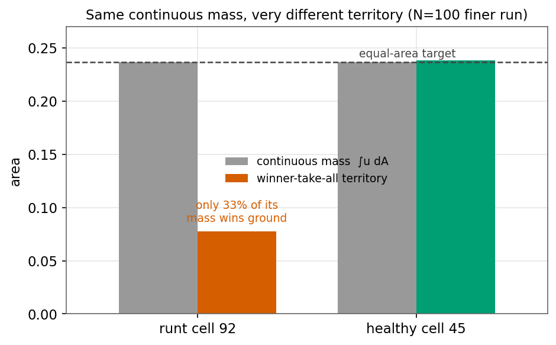
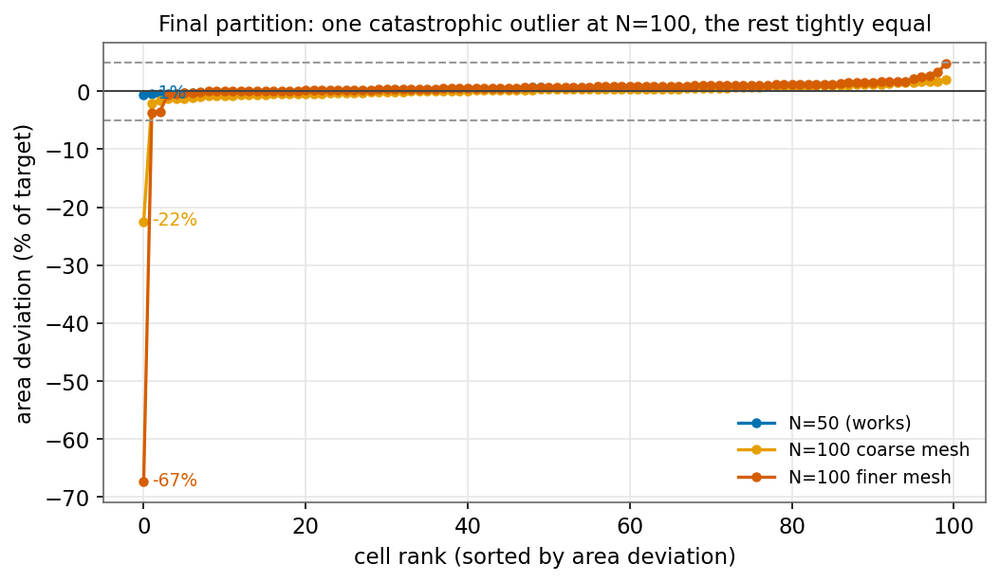

# The Winner-Take-All Partition Gap at High N (Dormant & Runt Cells)

Phase 1 optimizes **continuous density functions** and enforces equal areas on
them; the actual partition is then extracted by a **winner-take-all** (argmax)
hard decision. These two representations do not agree: a cell can satisfy the
*continuous* equal-area constraint exactly while its *discrete* winner-take-all
territory is far from equal. This gap is the single root cause behind two failures
we have hit as the number of regions **N** grows:

- **Dormant cells** — a cell wins *no* territory and vanishes; you asked for N
  regions and got N−k. **Status: resolved** for the regimes tested, via seeded
  initialization.
- **Runt cells** — a cell wins *some* territory but far too little (⅓ of target);
  the partition has N regions but grossly unequal areas, which makes Phase 2
  perimeter refinement infeasible (perimeter rises, then "local infeasibility").
  **Status: open.**

They are two severities of the same disease. This document unifies both: the
shared mechanism, what was tried, what worked, what did not, the results analysis
that located the runt's origin, and the open problem. It supersedes the earlier
`phase1_dormant_cell_argmax_issue.md` and `phase2_high_n_equal_area_infeasibility.md`.

---

## 1. The shared mechanism: continuous mass vs discrete territory

Phase 1 minimizes the Γ-convergence (Modica–Mortola-type) energy over a density
field `u ∈ ℝ^(V×N)`, `u_k(x) ∈ [0,1]` = "how strongly cell k claims vertex x":

```
E(u) = ε · Σ_k u_kᵀ K u_k  +  (1/ε) · Σ_k (u_k²(1−u_k)²)ᵀ M (u_k²(1−u_k)²)  +  λ · P(u)
```

> **Caveat (found after this study).** The interface term above is the form the
> code *currently* computes, but it is **mis-discretized** — it should use `u(1−u)`,
> not `u²(1−u)²` (a typo copied from the paper), making the coded well `∫u⁴(1−u)⁴`
> and its gradient inconsistent. See
> `docs/reference/phase1_energy_discretization_bug.md`. Every measurement in this
> document was taken under these (buggy) dynamics; the runt is priced ~25× too
> cheaply and its restoring force is attenuated, so the runt may soften once the
> energy is corrected. The mass-vs-territory *mechanism* is unaffected (it is a
> property of winner-take-all, not of the well), but the runt's *severity* must be
> re-measured after the fix.

subject to two constraints, both enforced exactly at every step by
`src/optimization/projection.py`:

- **Sum-to-one:** `Σ_k u_k(x) = 1` at every vertex.
- **Equal areas:** `∫ u_k dA = A/N` for every cell k.

The interface width is tied to the mesh: `ε = √(mean triangle area) ≈ h`
(`src/pipeline/relaxation.py`, `_setup_level`). The energy rewards crisp densities
(the double-well `u²(1−u)²`) and short interfaces (the Dirichlet `uᵀKu`); in the
limit ε→0 it equals the partition perimeter. The penalty `P(u)` (weight `λ`,
`lambda_penalty`) rewards each cell's density variance reaching that of a sharp
0/1 indicator — a **crispness reward**.

**The crux — two different meanings of "a cell's area":**

- **Continuous mass** `∫ u_k dA`. This is what the equal-area constraint controls,
  and it is held at `A/N` **exactly**. Think: each cell gets the same *volume of
  paint*.
- **Discrete territory.** After the run, `ContourAnalyzer` makes a hard decision:
  each vertex is awarded to the cell with the largest density (winner-take-all /
  argmax). A cell's territory = area of the vertices it wins. **This is the actual
  partition, and it is what Phase 2 receives.**

Nothing in Phase 1 — not the energy, not the constraints — references the argmax.
So "equal paint" (mass) is guaranteed; "equal territory" is not. For a *healthy*
cell (density ≈1 on a compact blob, ≈0 elsewhere) the two agree. When a cell
spreads its paint thin instead of concentrating it, they diverge — and that is the
failure.

## 2. Two manifestations of one gap

| | **Dormant cell** | **Runt cell** |
|---|---|---|
| Winner-take-all territory | **zero** — wins no vertex | nonzero but **≈ ⅓ of target** |
| Peak density `max(u_k)` | low (~0.08), never a winner | **1.0** — a confident winner in its small core |
| Alive on the map? | no — cell vanishes (N→N−k) | yes — present but undersized |
| What breaks | wrong cell **count** | unequal **areas** → Phase 2 infeasible |
| Caught by `detect_dormant_cells()` | **yes** (0 wins / peak < 0.5) | **no** (peak = 1.0, wins > 0) |
| Caught by `detect_area_imbalance()` | yes (territory 0) | **yes** (territory ≪ target) |
| Status | **resolved** (seeded init) | **open** |

Dormant = the extreme where territory collapses to zero. Runt = territory nonzero
but nowhere near fair. Same root cause; different severity and different symptom.

## 3. Manifestation A — Dormant cells (RESOLVED)

**What it was.** On the torus at N=30, two cells satisfied `∫u_k = A/N` throughout
but sat at a uniform low density (~0.03) over ~⅔ of the mesh, never winning any
vertex. After winner-take-all they produced zero boundary triangles and vanished —
a run requesting 30 regions produced 28.

**What was tried, and what worked:**

- **More mesh resolution — weak, unreliable.** A fixed-seed sweep over four base
  resolutions (154→320 vertices/cell) left the dead-cell count non-monotonic
  (2→1→1→2); the highest-resolution run still lost two cells. Doubling per-cell
  budget did not reliably help.
- **λ tuning — not a fix.** Across λ ∈ {1…10}: low λ leaves cells mushy; high λ
  binarizes aggressively and pushes struggling cells to zero *faster*. No λ forces
  a diffuse cell to acquire a winning region, because no energy term rewards doing
  so.
- **Seeded initialization — the fix. ✅** `create_seeded_initial_condition()`
  (`src/optimization/initialization.py`) replaces uniform-random level-0 densities
  with N farthest-point Voronoi seed regions, giving every cell a contiguous
  winning region from iteration 0. On the previously-failing N=30 config it
  produced 0 dead / 0 weak cells (every cell peak density 1.0), deterministically.
  Selected by `relaxation.init_method: seeded` (mandatory for N ≥ 30).

**Detection. ✅** `detect_dormant_cells()` (`src/partition/find_contours.py`) flags
*dead* (0 argmax wins) and *weak* (peak density < 0.5) cells; `run_relaxation`
warns and writes the `dormant_cells` block to `metadata.yaml`.

**Status: resolved for the regimes tested (N ≤ 50).** But seeded init does *not*
prevent the runt at N=100 (see §5) — it fixes the *count*, not the *area balance*.

## 4. Manifestation B — Runt cells (OPEN)

**The failure.** Two N=100 torus runs (λ=2.1, seed 84172851) both failed Phase 2:
instead of decreasing, the total perimeter *rose* every iteration and IPOPT stopped
with "Algorithm converged to a point of local infeasibility." Root cause: the
Phase 1 solution has one grossly undersized cell, so Phase 2's equal-area
constraint is violated by a huge margin from iteration 0. IPOPT (feasibility-first)
fights the imbalance by pushing the runt's boundaries outward — which lengthens
perimeter — and never reaches feasibility.

The Phase 2 iter-0 "max constraint violation" **is** the worst cell's absolute area
deviation in the Phase 1 solution:

| | N=50 (works) | N=100 coarse | N=100 finer |
|---|---|---|---|
| finest mesh (V) | 348×328 (114,144) | 348×328 (114,144) | 494×464 (229,216) |
| final ε | 0.010186 | 0.010186 | **0.007188** |
| worst-cell area dev | **0.76%** (0.0036) | 22.5% (0.053) | **67.3%** (0.160) |
| Phase 2 perimeter | 152 → **130 (−14.5%)** | 217 → 229 (**rises**) | 216 → 226 (**rises**) |
| Phase 2 outcome | converges (viol → 1e-11) | infeasibility crash | infeasibility crash |

Two controlled facts: N=50 and N=100-coarse ran on the **identical finest mesh**
(ε = 0.010186), so the driver is **N**, not the mesh; and the finer mesh has a
*smaller/sharper* ε yet a *worse* runt, so "finer is worse" is **not** an
interface-width effect (see §5).

**The runt in one picture.** In the finer run, cell 92 holds its full continuous
mass (∫u₉₂ dA = 0.2369 = target exactly) but only **33% of that mass wins ground**;
the other 67% is a diffuse low halo over its neighbors' territory. It is not
dormant — peak density 1.0, wins 689 vertices — just tiny on the map.



## 5. Results analysis — where the runt comes from (Step 0)

A forensic pass over the three existing solutions (zero new compute) tracked every
cell's winner-take-all territory across all five refinement levels. The
reconstruction was validated against the known final value (finer run: cell 92
= 0.0774, worst −67.3% → abs dev 0.160, matching `x_opt` and the Phase 2 log).


**End-of-level worst-cell area error (% of target):**

| level | N=50 | N=100 coarse | N=100 finer |
|---|---|---|---|
| 0 (seeded init) | 54.2 | 54.6 | 47.8 |
| 1 | 2.8 | 45.9 | 39.7 |
| 2 | 1.6 | 34.7 | **62.3** |
| 3 | 0.8 | 28.4 | 65.6 |
| 4 (final) | **0.8** | **22.5** | **67.3** |

Three findings, each consequential:

1. **The seeded init is badly unequal for *all three* runs** — including the one
   that works. Every init starts at ~16–19% area spread with a worst cell near
   −50%. So the init is **not** the discriminator between success and failure.

2. **The relaxation equalizes the *bulk* in every run** (the std of areas collapses
   at a "condensation" level — L1 for N=50, L2 for N=100 — where the mesh gets fine
   enough for cells to form compact blobs). See the left panel: all three fall.

3. **At N=100 the relaxation equalizes the bulk by *sacrificing one cell*.** As the
   bulk tightens, one cell is left behind and absorbs the residual imbalance. At
   N=50 the relaxation equalizes *every* cell (worst → 0.8%). At N=100 it cannot fit
   100 equal compact blobs, so it dumps the leftover onto a runt — and the
   equal-*continuous-mass* constraint permits this because the lost territory just
   becomes diffuse halo.

The final distribution makes the "one sacrifice" explicit: at N=100 a single cell
sits at −22%/−67% while the other 99 are within a few percent of target.



**Answer to "born at init or during relaxation?"** The imbalance is present at init
for everyone, but the *catastrophic runt is manufactured during relaxation*, at the
condensation level, and only at high N. The cell that collapses (92 in the finer
run) is **not** the init's worst cell — it was middling (−27%) at init and the
initially-worst cell *recovered*. So the runt cannot be predicted or prevented from
the starting point.

**On finer-is-worse:** the coarse run's runt partially *recovers* across levels
(−55%→−22%) while the finer run's *deepens* (−48%→−67%). Sharper interfaces
(smaller ε) condense more decisively, so the loser loses harder — but with only two
runs this cannot be fully separated from non-convex seed/mesh luck. Either way, the
finer mesh did not help.

## 6. What has been tried — status table

| Lever | Effect on **dormant** | Effect on **runt** | Verdict |
|---|---|---|---|
| Seeded init (equal-mass Voronoi) | **fixes it** ✅ | does **not** fix it (all inits equally unequal; runt made *during* relaxation) | resolves count, not area balance |
| More / finer mesh | weak, non-monotonic | **counterproductive** (finer = deeper runt) | wrong lever |
| λ tuning (soft crispness penalty) | no fix (swept 1–10) | soft λ=2.1 insufficient; a *hard* crispness floor is the plausible form | not sufficient as a soft penalty |
| Detection gate | `detect_dormant_cells()` ✅ | `detect_area_imbalance()` ✅ | both catch, neither fixes |
| Discrete-territory / crispness **constraint** | n/a | **untested — the front-runner** (see §8) | open |

## 7. Detection (both gates implemented)

Both run at the end of Phase 1 in `run_relaxation` (log + CLI banner + a
`metadata.yaml` block). From an existing solution:

```python
import h5py, numpy as np, sys; sys.path.insert(0, '.')
from src.mesh.tri_mesh import TriMesh
with h5py.File(SOLUTION_H5, 'r') as f:
    V=f['vertices'][:]; F=f['faces'][:].astype(np.int64); x=f['x_opt'][:]; N=int(f.attrs['n_partitions'])
u=x.reshape(V.shape[0],N); v=np.asarray(TriMesh(V,F).v).ravel()
win=np.argmax(u,1); areas=np.zeros(N); np.add.at(areas,win,v); target=v.sum()/N
worst_rel = np.abs(areas-target).max()/target     # == Phase 2 iter-0 constraint violation / target
# clean N=50: 0.008.  Broken N=100: 0.22 (coarse), 0.67 (finer).
```

- `detect_dormant_cells()` — flags *dead* (0 wins) / *weak* (peak < 0.5). Misses
  runts (peak 1.0).
- `detect_area_imbalance()` — flags cells whose territory deviates > `AREA_IMBALANCE_REL_THRESHOLD = 0.05`
  from target. Catches both dormant (territory 0) and runts. Verified: fires on both
  N=100 solutions (0.160 / 0.053), silent on N=50 (0.0036).

## 8. Open problem: fixing the runt

Step 0 (§5) reorders the candidate fixes — the relaxation *actively manufactures*
the runt because nothing forbids a cell from parking its mass as halo, so the fix
must change what the optimizer is *required* to achieve, not just its starting
point.

1. **Additional constraint on discrete territory / crispness — the front-runner.**
   The equal-continuous-mass constraint is too weak: it is satisfied by the halo.
   Either (a) a **hard crispness floor** (require every cell's density variance ≥
   ~90% of a sharp indicator's; then "crisp + equal mass ⟹ equal territory",
   enforced), or (b) **annealed soft-territory equality** (constrain a
   temperature-softened territory to be equal and anneal temperature → 0, driving
   the *actual* winner-take-all territory toward equal). Both make the projection a
   harder nonlinear solve and are best folded into the projection redesign the
   N=1000 scaling plan already calls for.
2. **Improve the initial condition (equal-area / Lloyd seeding) — downgraded.** N=50
   succeeds from an equally-bad init and the runt is created during relaxation, so a
   cleaner init is neither necessary nor clearly sufficient. May reduce the residual
   the relaxation concentrates, but not the mechanism.
3. **λ as a hard constraint, not a bigger soft penalty.** Same idea as 1(a);
   soft λ=2.1 already failed.
4. **Re-roll the seed — cheapest empirical shot at N=100 specifically**, but a
   lottery that does not scale (more cells → higher odds one loses the squeeze).
5. **Downstream band-aids (no Phase-1 rerun):** an area-restoration relabel that
   grows the runt's territory before Phase 2, or a Phase-2 area-homotopy. Cheapest
   to try; could salvage the existing N=100 solutions without new compute.

**Next experiment (compute-aware):** prototype the hard crispness floor and check
whether the level-2 sacrifice disappears — testable first on a *fast proxy* (small
surface or truncated levels), before any full ~40 h N=100 run.

## 9. Related documents, code, and data

- Experiment: `docs/experiments/01-winner-take-all-partition-gap/` — the measured
  study behind §4–5 (the level-by-level trajectory reconstruction and the three
  figures, as a reproducible LaTeX report with provenance). This reference doc is
  the standing explanation; that report is the measurement.
- Plan: `docs/plans/PHASE1_N1000_SCALING_PLAN.md` (the §6 validation gates now
  require `detect_area_imbalance`; the runt is the "partition validity" wall that
  plan flags as orthogonal to its performance walls),
  `docs/plans/PHASE1_SEEDED_INITIALIZATION_PLAN.md` (the seeded-init fix for
  dormant cells).
- Code: `src/optimization/pgd_optimizer.py` (energy + `λ` variance penalty),
  `src/pipeline/relaxation.py` (`ε = √mean_triangle_area`; both detection gates),
  `src/optimization/projection.py` (equal-mass + sum-to-one projection),
  `src/optimization/initialization.py` (seeded init),
  `src/partition/find_contours.py` (`detect_dormant_cells`, `detect_area_imbalance`,
  winner-take-all classification),
  `src/optimization/perimeter_optimizer.py` (Phase 2 equal-area constraint).
- Data: the three anchor runs under `results/` (N=50 `run_20260625_113015`,
  N=100 coarse `run_20260629_141012`, N=100 finer `run_20260701_143238`); figures
  regenerated from their `traces/` and `solution/` HDF5.
- Method: Bogosel & Oudet, *Partitions of Minimal Length on Manifolds*,
  Experimental Mathematics (2023); arXiv:1606.02873 — ε ∝ h, winner-take-all
  recovery, equal-area constraint, demonstrated at modest N.
