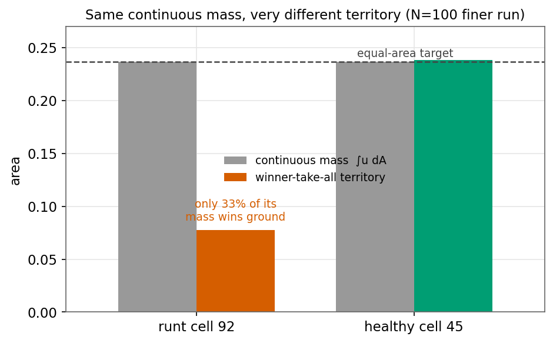
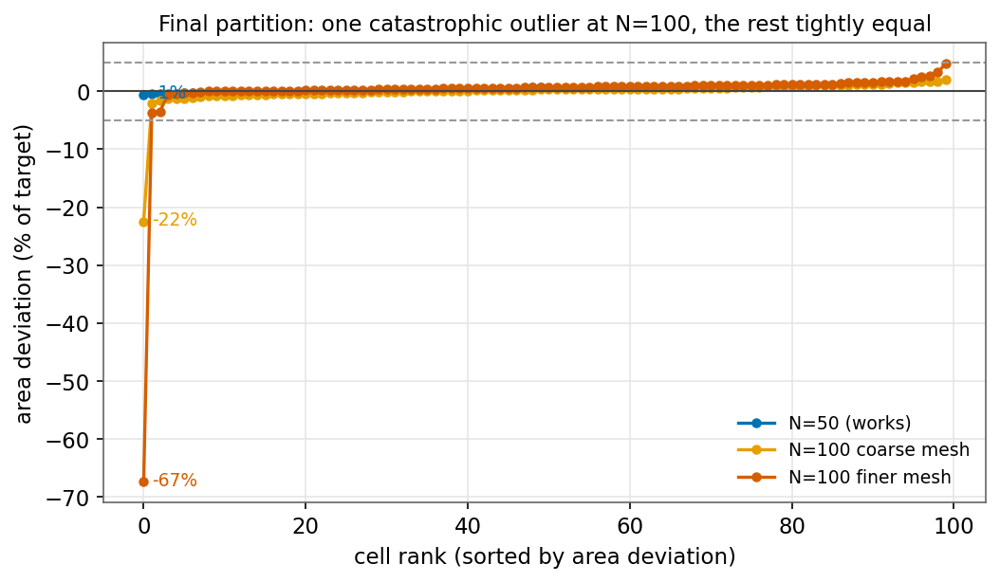

# The Winner-Take-All Partition Gap at High N (Dormant, Runt & Split Cells)

Phase 1 optimizes **continuous density functions** and enforces equal areas on
them; the actual partition is then extracted by a **winner-take-all** (argmax)
hard decision. These two representations do not agree: a cell can satisfy the
*continuous* equal-area constraint exactly while its *discrete* winner-take-all
territory is far from equal. This gap is the single root cause behind three failures
we have hit as the number of regions **N** grows:

- **Dormant cells** — a cell wins *no* territory and vanishes; you asked for N
  regions and got N−k. **Status: resolved** for the regimes tested, via seeded
  initialization.
- **Runt cells** — a cell wins *some* territory but far too little (⅓ of target);
  the partition has N regions but grossly unequal areas, which *made* Phase 2
  perimeter refinement infeasible (perimeter rises, then "local infeasibility").
  **Status: resolved.** The runt turned out to be largely an artifact of a
  **mis-discretized energy** — the double well was coded ~25× too weak, so the
  diffuse "halo" that becomes a runt was priced far too cheaply and the crispness
  weight λ was an inert lever (see
  `docs/reference/phase1_energy_discretization_bug.md`). On the **corrected** energy
  with a moderate `lambda_penalty=5.1`, the N=100 worst-cell area error drops from
  **22.5% → 0.8%** and Phase 2 refinement *decreases* perimeter (**−13.6%**) instead
  of crashing. See §4 and §8.
- **Split cells** — a cell holds ≈ the right *total* area but in 2+ **disconnected
  islands**; it passes both area-based gates and only a connectivity test sees it.
  **Status: open.** Reseeding is *falsified* as a mitigation (the proven-clean seed
  gives 14/200 fragmented, worse than the 3/200 that motivated the reseed), and the
  leading suspect is now the discrete-area trim buying a cell's area with
  disconnected mass. See §4b.

They are three severities of the same disease. This document unifies them: the
shared mechanism, what was tried, what worked, what did not, the results analysis
that located the runt's origin, and how it was resolved. It supersedes the earlier
`phase1_dormant_cell_argmax_issue.md` and `phase2_high_n_equal_area_infeasibility.md`.

---

## 1. The shared mechanism: continuous mass vs discrete territory

Phase 1 minimizes the Γ-convergence (Modica–Mortola-type) energy over a density
field `u ∈ ℝ^(V×N)`, `u_k(x) ∈ [0,1]` = "how strongly cell k claims vertex x":

```
E(u) = ε · Σ_k u_kᵀ K u_k  +  (1/ε) · Σ_k (u_k²(1−u_k)²)ᵀ M (u_k²(1−u_k)²)  +  λ · P(u)
```

> **Caveat / update (this is the pre-fix energy).** The interface term written above
> is the **buggy** form the code used when the §4–§5 measurements were taken: it used
> `u²(1−u)²` where the correct quantity is `q = u(1−u)` (a typo copied from the paper),
> making the coded well `∫u⁴(1−u)⁴` — ~25× too weak — with an inconsistent gradient.
> This has since been **fixed** (`interface_vec = u(1−u)`; see
> `docs/reference/phase1_energy_discretization_bug.md`). Every measurement in §4–§5
> below was taken under the *buggy* dynamics, where the runt's diffuse halo was priced
> ~25× too cheaply and its restoring force was attenuated. **Re-measured on the
> corrected energy the runt resolves** (see §8): the mass-vs-territory *mechanism* is
> unchanged (it is a property of winner-take-all, not of the well), but its *severity*
> collapses once the well is priced correctly and λ — now an effective lever — is set
> to a moderate 5.1. The correct discretized energy is
> `E(u) = ε·Σ_k u_kᵀ K u_k + (1/ε)·Σ_k q_kᵀ M q_k + λ·P(u)` with `q_k = u_k(1−u_k)`.

subject to two constraints, both enforced exactly at every step by
`src/optimization/projection.py`:

- **Sum-to-one:** `Σ_k u_k(x) = 1` at every vertex.
- **Equal areas:** `∫ u_k dA = A/N` for every cell k.

The interface width is tied to the mesh: `ε = √(mean triangle area) ≈ h`
(`src/pipeline/relaxation.py`, `_setup_level`). The energy rewards crisp densities
(the double-well `u²(1−u)²`) and short interfaces (the Dirichlet `uᵀKu`); in the
limit ε→0 it equals the partition perimeter. The penalty `P(u)` (weight `λ`,
`lambda_penalty`) rewards each cell's density variance reaching that of a sharp
0/1 indicator — a **crispness reward**.

**The crux — two different meanings of "a cell's area":**

- **Continuous mass** `∫ u_k dA`. This is what the equal-area constraint controls,
  and it is held at `A/N` **exactly**. Think: each cell gets the same *volume of
  paint*.
- **Discrete territory.** After the run, `ContourAnalyzer` makes a hard decision:
  each vertex is awarded to the cell with the largest density (winner-take-all /
  argmax). A cell's territory = area of the vertices it wins. **This is the actual
  partition, and it is what Phase 2 receives.**

Nothing in Phase 1 — not the energy, not the constraints — references the argmax.
So "equal paint" (mass) is guaranteed; "equal territory" is not. For a *healthy*
cell (density ≈1 on a compact blob, ≈0 elsewhere) the two agree. When a cell
spreads its paint thin instead of concentrating it, they diverge — and that is the
failure.

## 2. Two manifestations of one gap

| | **Dormant cell** | **Runt cell** | **Split cell** |
|---|---|---|---|
| Winner-take-all territory | **zero** — wins no vertex | nonzero but **≈ ⅓ of target** | ≈ target total, but in **2+ disconnected islands** |
| Peak density `max(u_k)` | low (~0.08), never a winner | **1.0** — a confident winner in its small core | **1.0** in every piece |
| Alive on the map? | no — cell vanishes (N→N−k) | yes — present but undersized | yes — present but fragmented |
| What breaks | wrong cell **count** | unequal **areas** → Phase 2 infeasible | non-physical topology → Phase 2 multi-loop contours |
| Caught by `detect_dormant_cells()` | **yes** (0 wins / peak < 0.5) | **no** (peak = 1.0, wins > 0) | **no** (peak = 1.0, wins > 0) |
| Caught by `detect_area_imbalance()` | yes (territory 0) | **yes** (territory ≪ target) | **no** (total territory ≈ target) |
| Caught by `detect_disconnected_cells()` | — | — | **yes** (≥2 components) |
| Status | **resolved** (seeded init) | **resolved** (corrected energy + moderate λ) | **open** — detected only; reseed **falsified** as a mitigation (§4b) |

Dormant = the extreme where territory collapses to zero. Runt = territory nonzero
but nowhere near fair. Split = territory the right *total* size but broken into
disconnected pieces. Same winner-take-all root cause; three different symptoms,
and the split cell is the only one that slips through *both* area-based gates
(§ Manifestation C).

## 3. Manifestation A — Dormant cells (RESOLVED)

**What it was.** On the torus at N=30, two cells satisfied `∫u_k = A/N` throughout
but sat at a uniform low density (~0.03) over ~⅔ of the mesh, never winning any
vertex. After winner-take-all they produced zero boundary triangles and vanished —
a run requesting 30 regions produced 28.

**What was tried, and what worked:**

- **More mesh resolution — weak, unreliable.** A fixed-seed sweep over four base
  resolutions (154→320 vertices/cell) left the dead-cell count non-monotonic
  (2→1→1→2); the highest-resolution run still lost two cells. Doubling per-cell
  budget did not reliably help.
- **λ tuning — not a fix.** Across λ ∈ {1…10}: low λ leaves cells mushy; high λ
  binarizes aggressively and pushes struggling cells to zero *faster*. No λ forces
  a diffuse cell to acquire a winning region, because no energy term rewards doing
  so.
- **Seeded initialization — the fix. ✅** `create_seeded_initial_condition()`
  (`src/optimization/initialization.py`) replaces uniform-random level-0 densities
  with N farthest-point Voronoi seed regions, giving every cell a contiguous
  winning region from iteration 0. On the previously-failing N=30 config it
  produced 0 dead / 0 weak cells (every cell peak density 1.0), deterministically.
  Selected by `relaxation.init_method: seeded` (mandatory for N ≥ 30).

**Detection. ✅** `detect_dormant_cells()` (`src/partition/find_contours.py`) flags
*dead* (0 argmax wins) and *weak* (peak density < 0.5) cells; `run_relaxation`
warns and writes the `dormant_cells` block to `metadata.yaml`.

> **Seeded init is now mandatory for a *second*, stronger reason (energy fix).** The
> double-well correction (`docs/reference/phase1_energy_discretization_bug.md`) made
> the well ~25× steeper, which turned the *symmetric diffuse state* (every cell at
> `1/N` everywhere) into a genuine local minimum: there the projected gradient damps
> perturbations rather than amplifying them, so **random** init freezes without ever
> breaking symmetry. Head-to-head at N=30, `lambda_penalty=2.1`, corrected energy:
> random init ends with **23 imbalanced cells / 43% worst-cell** area error, seeded
> init ends **clean (0.7%)**. Under the old (flatter, buggy) well this trap was weak,
> so random "worked" at low N. On the corrected energy, seeded is not optional.

**Status: resolved for the regimes tested (N ≤ 100).** Seeded init fixes the *count*;
on the *buggy* energy it did **not** by itself fix the *area balance* (the runt at
N=100 — see §5). What fixed the runt was the **energy correction plus a moderate λ**
(§8), which seeded init then complements: seeded gives every cell a start, the
corrected well + λ keeps every cell crisp and equal-territory through relaxation.

## 4. Manifestation B — Runt cells (RESOLVED)

> **This section documents the pre-fix failure; the resolution is in §8.** The runs
> below used the buggy (~25×-too-weak) double well. On the corrected energy with
> `lambda_penalty=5.1` the same N=100 case has worst-cell 0.8% and Phase 2 *decreases*
> perimeter (−13.6%). The forensic record is kept because it locates *where* and *why*
> the runt formed, which is what made the fix (§8) targeted rather than a guess.

**The failure (pre-fix).** Two N=100 torus runs (λ=2.1, seed 84172851) both failed
Phase 2: instead of decreasing, the total perimeter *rose* every iteration and IPOPT
stopped with "Algorithm converged to a point of local infeasibility." Root cause: the
Phase 1 solution has one grossly undersized cell, so Phase 2's equal-area
constraint is violated by a huge margin from iteration 0. IPOPT (feasibility-first)
fights the imbalance by pushing the runt's boundaries outward — which lengthens
perimeter — and never reaches feasibility.

The Phase 2 iter-0 "max constraint violation" **is** the worst cell's absolute area
deviation in the Phase 1 solution:

| | N=50 (works) | N=100 coarse | N=100 finer |
|---|---|---|---|
| finest mesh (V) | 348×328 (114,144) | 348×328 (114,144) | 494×464 (229,216) |
| final ε | 0.010186 | 0.010186 | **0.007188** |
| worst-cell area dev | **0.76%** (0.0036) | 22.5% (0.053) | **67.3%** (0.160) |
| Phase 2 perimeter | 152 → **130 (−14.5%)** | 217 → 229 (**rises**) | 216 → 226 (**rises**) |
| Phase 2 outcome | converges (viol → 1e-11) | infeasibility crash | infeasibility crash |

Two controlled facts: N=50 and N=100-coarse ran on the **identical finest mesh**
(ε = 0.010186), so the driver is **N**, not the mesh; and the finer mesh has a
*smaller/sharper* ε yet a *worse* runt, so "finer is worse" is **not** an
interface-width effect (see §5).

**The runt in one picture.** In the finer run, cell 92 holds its full continuous
mass (∫u₉₂ dA = 0.2369 = target exactly) but only **33% of that mass wins ground**;
the other 67% is a diffuse low halo over its neighbors' territory. It is not
dormant — peak density 1.0, wins 689 vertices — just tiny on the map.



## 4b. Manifestation C — Split (disconnected) cells

**The failure.** A cell's winner-take-all territory holds ≈ the right *total* area
but is broken into two or more **disconnected islands** on the surface. Each island
is crisp (peak density 1.0) and the islands sum to the target area, so the cell
passes **both** area-based gates — `detect_dormant_cells()` (it wins plenty of
vertices) *and* `detect_area_imbalance()` (its total territory is fair). Only a
connectivity test sees it. A minimal-perimeter cell is connected (a split cell
carries excess boundary), so this is a **non-physical relaxation local minimum**,
not a valid partition cell.

**Why the optimizer is happy with it.** Nothing in the objective penalizes
disconnection: the Γ-convergence energy, the WTA balance term
(`P_bal = (γ/2)Σr_k²` over *total* territory), and the discrete-area trim all
reward the correct *total* area per cell, none cares how many pieces that area is
in. So an area-balanced fragmented cell is a stable fixed point.

**Where it was first seen.** Torus **N=200** (`run_20260722_121925`, seed
84172851, λ=9, adaptive schedule): the final solution reported **0 dead, 0
imbalanced** (worst-cell area dev 2.68%), yet **3/200 cells** (58, 168, 17) were
split into 3–4 islands — worst cell 58 in three chunks of 0.050 / 0.039 / 0.028
(stray = 57% of a cell). Tracing connectivity back through the mesh levels showed
the fragmentation was *worst at the coarsest level* (8 split cells at level 0,
where large ε makes the diffuse argmax boundary easy for a neighbour to pinch
through) and the count then *fell* with refinement (8 → 6 → 3 → 3). At the time
this was read as a coarse-level pinch that finer levels could not fully reconnect,
and attributed to the **seed lottery** of §9.

**That seed-lottery reading is falsified** (2026-08-03). The reseed run
`run_20260730_211516` (seed **61803399** — the seed *proven clean* at this N and
mesh, 0 fragmented, in the term-**OFF** deliverable `run_20260722_175451` — with
λ=11 and the same adaptive schedule) was checked mid-ladder at
`solution/checkpoint_level02.h5` (levels 0–1 done, V=24,948, `wta_active=True`):

| | seed 84172851, λ=9 | seed 61803399, λ=11 |
|---|---|---|
| dead / imbalanced | 0 / 0 | 0 / **1** (cell 184, 8.31%) |
| **fragmented** | **3**/200 (final, level 4) | **14**/200 (level 2) |
| worst stray | 57% (cell 58) | **43.6%** (cell 198, 3 pieces) |
| most pieces | 4 | **7** (cell 16) |

The "good" seed is **worse**, so reseeding is not a mitigation. Fragment sizes
confirm these are real splits, not `DISCONNECTED_FRAGMENT_REL_THRESHOLD` noise:
target area = 4π²Rr/200 = 0.1184, and cell 198's pieces are
0.0663 + 0.0474 + 0.0042 = **0.1179** — dead on target, in three places at once,
with the second piece 40% of a whole cell. Cell 198 does **not** appear in the
imbalanced list; only 15 cells have >1 raw component and 14 clear the threshold.

**The driver is the discrete-area trim, not the seed.** In this run the adaptive
handoff **never fired** (level ends 12.69% and 8.31% both exceed
`wta_switch_margin=0.03`), so the trim ran on *every* level — unlike
`run_20260722_121925`, where the fragment count fell precisely over the levels
that had handed off to cheap E₀. The `relaxation.log` carries the causal trace:
the trim's persistent worst-deviation targets at level 0 were cells **198**
(dev 41.8 → 44.4 → 53.1 → 55.8 → 57.8 → 61.2 → 67.0 → 63.7%, dominating for
hours) and **16** (48.2, 45.4, 38.3, 37.0, 35.4%), with 37 still flagged at the
level end. Those are exactly the **two worst fragmented cells** at level 2 (198 at
43.6%; 16 with seven components), and 37 is in the flagged list. The trim drove
their *total* area to target by handing them **disconnected territory** — which is
the stable fixed point described above, since nothing penalizes disconnection.
The trim was also **clamp-saturated** (`d range [0.800, 1.200] × Ā` = exactly
±`wta_trim_clamp=0.20`) for most of the run, i.e. pushing at maximum authority.

*Confidence.* The counts and the log trace are measured, and the **term-OFF control
is matched**: `run_20260722_175451` differs from `run_20260730_211516` only in the
machinery flags — same seed 61803399, same λ=11, same 5-level mesh — and it finished
all five levels with **0 fragmented** (worst area dev 1.7%) and was finalised as a
deliverable. The one remaining mismatch is the comparison level (2 vs final), and it
cuts *against* the machinery: the control was clean at the **end**, while the
territory run is at 14 **mid-ladder** with no healing mechanism.

What was *never* separated is **balance term vs trim**. `wta_balance_enabled` and
`wta_trim_enabled` were independent flags but were never enabled separately; the
trim is the suspect (the log trace and the handoff correlation both point at it), not
the proven culprit. A four-cell isolation experiment was specified for it (2×2 on
balance × trim at seed 61803399, λ=11, two levels to the 162×154 comparison point,
reduced gradient held as control) and its configs written, but the machinery was
removed before the runs happened — §9b made the question moot. The design is in git
history at commit `14e0518` (`docs/plans/PHASE1_TRIM_VS_BALANCE_ISOLATION.md` and
`parameters/torus_200part_s61803399_lam11_iso_*.yaml`) if it ever needs re-asking.

**At N=200 the machinery is a net regression, on two axes.** The term was added
because it looked necessary at **N=300**; at N=200 the *original* energy already
produces a valid, finalised partition (`run_20260722_175451`). Measured against
that baseline the machinery costs:

1. **Wall clock.** No level ever triggered mesh refinement — every completed level
   ran the full 30,000-iteration cap. The balance-plateau trigger built to bypass
   the trim sawtooth is *structurally unreachable while the trim runs*: the trim
   moves the target every 200 accepted iterations, so ‖g_t‖ never approaches zero
   (it flatlined at ≈20.33 against `refine_grad_tol=1e-2`, and the plateau fallback
   needs 30 consecutive |Δ‖g_t‖| < 1e-4). The adaptive handoff never fired either
   (level ends 12.69% and 8.31%, both above the 3% margin), so the expensive path
   ran on every level. Four days bought 2.4 of 5 levels — 11.2 h, 53.5 h, then
   31.4 h for 9,500/30,000 iterations; the full ladder extrapolates to **~20 days**.
2. **Connectivity.** 14/200 fragmented (above), versus 0 for the control.

So the term trades a problem N=200 does not have for two that it does. It is not
ready to be the N=300 answer either, since it would carry the fragmentation there.
This does not retract its measured success on *area* (`docs/experiments/04-...`,
Result 1: entrenched −34% runt → 0 imbalanced on the seed λ could not fix). The
defect is that **total area is the wrong invariant to enforce alone** — area and
connectivity have to be enforced together, or fixing the first breaks the second.

**Two findings from the machinery that outlive it.** Both were measured while
diagnosing the above and are about the *mesh*, not the term, so they survive its
removal:

1. **The coarsest level is resolution-floor-limited, so refinement is necessary —
   not merely faster.** At N=200 level 0 (48 verts/cell, band fraction
   `f_b = 3.72/√(2V/N) ≈ 20%`) floors at **~10%** worst-cell deviation and flatlines
   there (tail rate 0.23%/1000 it, still 4 cells over the 5% gate at the 30k cap) — no
   corrective force fixes a runt below the resolution floor. **Level 1** (124
   verts/cell) is the first level that crosses the gate, and it does so steeply
   (2.2%/1000 it, 0 imbalanced by ~iter 9,000, floor ~2%); level 2 started at 0 and
   held. The gate lies *between* the level-0 and level-1 floors.
2. **~124 verts/cell sufficed to cross the gate**, which puts the mesh-budget validity
   floor of `PHASE1_N1000_VALIDITY_PLAN.md` §5 (P3: finest-level verts/cell ≥ ~600)
   nearer **~250–300** — a 2–4× compute rebate at N=1000, worth confirming before it
   is assumed.

Corroborating the second half of (1) with the *original* energy: at N=150, running
plain E₀ on every level, the worst-cell deviation shrank monotonically with refinement
(−10.6% at 2 levels → −5.84% at 3 → −1.24% at 5). Refining an already-balanced
structure with the cheap energy improves balance; it does not break it.

**The code is gone; the result is not (2026-08-10).** The territory-aware machinery —
the WTA balance term, the discrete-area trim, the P2 reduced-gradient step/acceptance/
trigger fix, and the adaptive `wta_schedule` — was **removed from `main`**, since a
default-off path that is known to be a net regression is a trap for whoever finds the
flag next. What survives, deliberately: the derivation
(`docs/math/07-phase1-wta-balance/`, flagged not-adopted in the authoring guide), the
measurement (`docs/experiments/04-territory-aware-highn-validation/`), this section,
and the implementation itself in git history at commit `14e0518`. The three plans that
drove it (`PHASE1_TERRITORY_AWARE_IMPLEMENTATION_PLAN`, `PHASE1_COARSE_ONLY_WTA_SCHEDULE`,
`PHASE1_TRIM_VS_BALANCE_ISOLATION`) were retired into this section.

**Status: detected; reseed ruled out as mitigation; resolved at extraction (§9b).**
`detect_disconnected_cells()` (§7) flags it, and the balanced readout repairs it.
The options weighed *before* §9b existed were: (a) ~~reseed~~ — **falsified above**;
(b) ~~brake the trim on connectivity~~ — moot, the trim is gone; (c) a
**connectivity-repair** post-process reassigning each stray island to the neighbour
that most surrounds it, then rebalancing — **this is what §9b does**, at readout
rather than in the flow; (d) a connectivity-aware term in the relaxation — not
needed, and the reason is (2) of §9b: a term reaches the field through a *nonlocal*
operator, which is how the trim manufactured islands in the first place. A fragmented
cell must still **not** be handed to Phase 2 — a disconnected cell produces multi-loop
contours the equal-area / Steiner machinery is not built for; run the readout first.

**Watch out: the gates only run at the *end* of `run_relaxation`**, so a run still on
the mesh ladder — or one killed before the last level, which never writes
`metadata.yaml` — reports *nothing*. Use
`testing/check_fragmentation.py <solution_or_checkpoint.h5>` (§7) to check any level's
checkpoint mid-ladder. That is how the 14 above were found, on a run that was still
reporting a healthy-looking 1 imbalanced cell.

## 4c. The locality criterion — apply this before writing code

**Two independent attempts to cheapen or correct Phase 1 have now failed by
manufacturing disconnected cells.** They look nothing alike, and they failed the
same way:

| attempt | how the correction reaches the field | result |
|---|---|---|
| Discrete-area trim (§4b) | retargets the projection's per-cell area targets `d`; the **projection** (rank-one + renormalise) delivers the mass | 14/200 fragmented vs 0/200 matched control |
| Soft area penalty, "A2" (`docs/experiments/05-soft-area-constraint/`) | adds `(μ/Ā²)·v_i·(v·u_k − Ā)` to the gradient — a **uniform per-cell field** | 3–4/100 fragmented vs 0/100 matched control; readout repair costs +22% boundary and breaks Phase 2 |

In both cases the correction is *nonlocal*: it reaches every part of a cell at
once. A cell short on area is therefore grown wherever it already has any
foothold — including a distant speck on the far side of a neighbour — and that
speck becomes an island. Since nothing in the energy penalises disconnection, the
island is a stable fixed point (§4b), so the damage is permanent.

**The screening test.** Before implementing any mechanism that corrects cell
area, territory, or balance, answer one question:

> **Through what operator does the correction reach the field, and is that
> operator local?**

A correction is *local* if increasing cell *k*'s share grows it **outward from
its existing boundary**, monotonically, without amplifying disconnected pieces.
It is *nonlocal* if it reaches the whole cell uniformly, or passes through a
global solve (a projection, a linear system, a normalisation coupling all
vertices). **Nonlocal corrections buy area with disconnected territory.** Expect
fragmentation and design for it, or choose a different operator.

This is not a retrospective observation. §9b stated the criterion in
2026-08-06, to explain why the trim failed and why the balanced readout's
per-cell offset in log-density space does not — and it **predicted A2's failure
mode four days before A2 was written**. The balanced readout passes the test:
raising `ψ_k` in `argmax_k[log u_ik + ψ_k]` grows a cell monotonically outward
from its core, which is why it relabels 1,840 vertices at N=300 for +1.9%
boundary while the trim manufactured islands.

**The starting constraint violation predicts whether Phase 2 will descend, and
the readout controls it.** Phase 2's iteration-0 max constraint violation is the
winner-take-all worst-cell area deviation times the target area `Ā`, measured to
within 3% on every run tried:

| solution | worst cell | predicted | Phase 2 reported | outcome |
|---|---|---|---|---|
| N=100 control, raw | 0.78% | 1.85e-3 | 1.85e-3 | 20 iterations, converges |
| N=100 A2 hybrid, raw | 1.21% | 2.87e-3 | 2.87e-3 | **`Restoration Failed!` in 8 s** |
| N=100 A2 hybrid, after readout | 0.20% | 4.74e-4 | 4.59e-4 | 20 iterations, converges |
| N=300 three-level, after readout | — | — | 1.31e-3 | converges |
| N=300 five-level, after readout | — | — | 5.09e-4 | converges |

A 1.55× larger starting violation was the entire difference between a clean
20-iteration descent and a restoration failure in eight seconds — on partitions
that are otherwise near-identical (14,623 variable points / 200 triple points vs
14,641 / 200, and the *better* extracted perimeter belongs to the one that
aborted). So **passing the three gates is necessary but not sufficient**: the
gates are pass/fail at 5%, while Phase 2 cares about the worst cell to a
fraction of a percent. Compute `worst_rel_dev × Ā` before starting Phase 2; if it
is not comfortably under ~2e-3 at N=100 scale, run the balanced readout first.

**This makes the readout a required stage of any fast Phase 1 path, not an
optional repair.** The A2 hybrid fails outright on the raw path and succeeds
through the readout; it does not get to claim the speedup without the
dependency.

**A corollary worth keeping.** Both failures were also invisible in their headline
metrics — the trim's area numbers looked excellent, and A2 was "32× faster with no
dead cells". **Check connectivity first**, before speed and before area:
`testing/check_fragmentation.py` runs all three gates on any solution or
mid-ladder checkpoint in seconds. A cheaper early read still is the balanced
readout's own strain: 0 blocked moves and low single-digit boundary cost is the
healthy signature (N=300: 1,485 moves, 1 blocked, +1.85%), while blocked moves
plus double-digit boundary cost means the relaxation handed it something broken
(A2: 13,540 moves, 213 blocked, +22.0%, sweep cap hit).

**And a diagnostic for the optimizer itself.** A2's speedup was inflated by
*every* level dying in a collapsed line search — no step accepted, energy frozen
bit-identically, the energy-plateau trigger then firing on the frozen energy and
reporting convergence. Two tells distinguish a dead optimizer from a converged
one: winner-take-all label churn that is **exactly** zero rather than small, and
per-iteration cost that *rises* at the moment progress stops (convergence gets
cheaper; a collapsing line search backtracks ~40 times per iteration). A guard in
`src/optimization/pgd_optimizer.py` now warns after 50 consecutive rejected
iterations.

## 5. Results analysis — where the runt comes from (Step 0)

A forensic pass over the three existing solutions (zero new compute) tracked every
cell's winner-take-all territory across all five refinement levels. The
reconstruction was validated against the known final value (finer run: cell 92
= 0.0774, worst −67.3% → abs dev 0.160, matching `x_opt` and the Phase 2 log).


**End-of-level worst-cell area error (% of target):**

| level | N=50 | N=100 coarse | N=100 finer |
|---|---|---|---|
| 0 (seeded init) | 54.2 | 54.6 | 47.8 |
| 1 | 2.8 | 45.9 | 39.7 |
| 2 | 1.6 | 34.7 | **62.3** |
| 3 | 0.8 | 28.4 | 65.6 |
| 4 (final) | **0.8** | **22.5** | **67.3** |

Three findings, each consequential:

1. **The seeded init is badly unequal for *all three* runs** — including the one
   that works. Every init starts at ~16–19% area spread with a worst cell near
   −50%. So the init is **not** the discriminator between success and failure.

2. **The relaxation equalizes the *bulk* in every run** (the std of areas collapses
   at a "condensation" level — L1 for N=50, L2 for N=100 — where the mesh gets fine
   enough for cells to form compact blobs). See the left panel: all three fall.

3. **At N=100 the relaxation equalizes the bulk by *sacrificing one cell*.** As the
   bulk tightens, one cell is left behind and absorbs the residual imbalance. At
   N=50 the relaxation equalizes *every* cell (worst → 0.8%). At N=100 it cannot fit
   100 equal compact blobs, so it dumps the leftover onto a runt — and the
   equal-*continuous-mass* constraint permits this because the lost territory just
   becomes diffuse halo.

   > **Corrected-energy update.** This "cannot fit 100 equal blobs at N=100" was an
   > artifact of the ~25×-too-weak well, **not** a geometric barrier. The under-priced
   > halo made sacrificing a cell nearly free, and the mis-scaled interface term left
   > λ unable to force crispness. On the corrected well with `lambda_penalty=5.1` the
   > relaxation *does* equalize all 100 cells (worst-cell **0.8%**, `n_imbalanced=0`).
   > So the "one sacrifice at high N" is a property of the *buggy* energy, not of N.
   > See §8.

The final distribution makes the "one sacrifice" explicit: at N=100 a single cell
sits at −22%/−67% while the other 99 are within a few percent of target.



**Answer to "born at init or during relaxation?"** The imbalance is present at init
for everyone, but the *catastrophic runt is manufactured during relaxation*, at the
condensation level, and only at high N. The cell that collapses (92 in the finer
run) is **not** the init's worst cell — it was middling (−27%) at init and the
initially-worst cell *recovered*. So the runt cannot be predicted or prevented from
the starting point.

**On finer-is-worse:** the coarse run's runt partially *recovers* across levels
(−55%→−22%) while the finer run's *deepens* (−48%→−67%). Sharper interfaces
(smaller ε) condense more decisively, so the loser loses harder — but with only two
runs this cannot be fully separated from non-convex seed/mesh luck. Either way, the
finer mesh did not help.

## 6. What has been tried — status table

| Lever | Effect on **dormant** | Effect on **runt** | Verdict |
|---|---|---|---|
| **Territory-aware machinery** (WTA balance term + discrete-area trim) | n/a | drives worst abs deviation down hard (N=200 level ends 12.7% → 8.3% → 5.4%) | **rejected and removed** ❌ — fixes area, creates splits: 14/200 fragmented, ~20-day ladder (§4b); enforces *total* area, not connectivity |
| **Soft continuous area constraint** ("A2": quadratic penalty + closed-form simplex projection) | n/a | holds it (worst 1.47%) | **rejected** ❌ — 32× faster and 0 dead cells, but 3–4/100 fragmented and every level died in a collapsed line search. Its exact-at-level-0 hybrid fixes connectivity (0 fragmented, all gates pass, 6.83×) and Phase 2 *still* aborts. See §4c and `docs/experiments/05-soft-area-constraint/` |
| **Balanced readout** (semi-discrete OT dual + connectivity repair, at extraction) | not measured on a dead cell (none in the test runs); the dual grows a zero-area cell in principle, but the seeded init already prevents them | **fixes it** — exact, by construction, to one-vertex granularity at any N | **the answer** ✅ — §9b; 10/300 → 0 imbalanced, 2 → 0 fragmented, +1.9% boundary, ~17 s |
| **Energy discretization fix** (`u²(1−u)²`→`u(1−u)`) | n/a | **root cause** — the coded well was ~25× too weak, under-pricing the halo *and* leaving λ inert; correcting it is what makes the runt fixable | **the fix** ✅ |
| λ tuning (crispness penalty) | no fix on the buggy well (swept 1–10) | **on the corrected well, moderate `λ=5.1` fixes it** (worst-cell 22.5% → 0.8%); *inert* on the buggy well — which is why the earlier 1–10 sweep saw nothing | **fixes it, with the energy fix** ✅ |
| Seeded init (equal-mass Voronoi) | **fixes it** ✅ | necessary complement — avoids the corrected-energy symmetric trap (§3) and gives every cell a start, but not sufficient *alone* (seeded-λ2.1 still runts) | required, not sufficient |
| More / finer mesh | weak, non-monotonic | **counterproductive** (finer = deeper runt, under the buggy well) | wrong lever |
| Detection gate | `detect_dormant_cells()` ✅ | `detect_area_imbalance()` ✅ | both catch |
| Hard discrete-territory / crispness **constraint** | n/a | **not needed** — once the well is correct, the *soft* λ penalty suffices; the hard-floor idea is superseded | superseded |

## 7. Detection (three gates implemented)

All three run at the end of Phase 1 in `run_relaxation` (log + CLI banner + a
`metadata.yaml` block). From an existing solution:

```python
import h5py, numpy as np, sys; sys.path.insert(0, '.')
from src.mesh.tri_mesh import TriMesh
with h5py.File(SOLUTION_H5, 'r') as f:
    V=f['vertices'][:]; F=f['faces'][:].astype(np.int64); x=f['x_opt'][:]; N=int(f.attrs['n_partitions'])
u=x.reshape(V.shape[0],N); v=np.asarray(TriMesh(V,F).v).ravel()
win=np.argmax(u,1); areas=np.zeros(N); np.add.at(areas,win,v); target=v.sum()/N
worst_rel = np.abs(areas-target).max()/target     # == Phase 2 iter-0 constraint violation / target
# clean N=50: 0.008.  Broken N=100: 0.22 (coarse), 0.67 (finer).
```

- `detect_dormant_cells()` — flags *dead* (0 wins) / *weak* (peak < 0.5). Misses
  runts (peak 1.0).
- `detect_area_imbalance()` — flags cells whose territory deviates > `AREA_IMBALANCE_REL_THRESHOLD = 0.05`
  from target. Catches both dormant (territory 0) and runts. Verified: fires on both
  N=100 solutions (0.160 / 0.053), silent on N=50 (0.0036).
- `detect_disconnected_cells()` — flags *split* cells (Manifestation C, below):
  builds the induced subgraph of mesh edges whose endpoints share an argmax winner
  and counts connected components per cell (via `scipy.sparse.csgraph`), so it
  respects true surface topology (torus periodic wrap in `faces`). A non-largest
  component is a genuine stray piece only if its area exceeds
  `DISCONNECTED_FRAGMENT_REL_THRESHOLD = 0.01` of target (else = argmax speckle).
  Catches what the other two miss — a split cell's pieces sum to target and each is
  crisp, so it passes *both*. Verified at torus N=200 (`run_20260722_121925`,
  seed 84172851): 3/200 cells fragmented (worst 57% stray) while dormant=0 and
  imbalance=0. Logic gate: `testing/test_disconnected_cells_detection.py`.

**All three run only on the FINAL solution**, so a run still climbing the mesh ladder,
or one killed before the last level (no `metadata.yaml`), reports none of them. To
check any level mid-ladder:

```bash
python testing/check_fragmentation.py <run_dir>/solution/checkpoint_level02.h5
```

It runs all three gates against a solution *or* a per-level checkpoint and prints
a pass/fail verdict. This is what exposed the 14 fragmented cells in §4b on a run
whose own logging still looked healthy.

## 8. Resolution — the corrected energy plus a moderate λ

The candidate fixes in §5–§6 were framed as "the equal-continuous-mass constraint is
too weak, so we must *add a hard crispness/territory constraint*." That framing had the
symptom right but the cause wrong. The reason the relaxation could park a cell's mass
as diffuse halo essentially for free is that the **double-well energy was mis-discretized
~25× too weak** — a typo copied from the paper (`docs/reference/phase1_energy_discretization_bug.md`).
Two consequences of that bug manufactured the runt:

1. The halo was **under-priced ~25×**, so leaving a cell diffuse cost almost nothing.
2. The mis-scaled interface term **dominated the crispness reward**, so **λ was an inert
   lever** — which is exactly why the earlier λ∈{1…10} sweep (§6) found nothing.

Correcting the discretization (`interface_vec = u(1−u)`) removes both: the halo is now
priced correctly, and λ is restored as an effective knob. With a **moderate
`lambda_penalty=5.1`** (up from 2.1) and seeded init, the N=100 relaxation equalizes
*all* 100 cells:

| | N=100 buggy, λ=2.1 (pre-fix) | N=100 corrected, λ=2.1 | N=100 corrected, λ=5.1 |
|---|---|---|---|
| worst-cell area error | 22.5% | 21.8% (barely moved) | **0.8%** |
| `n_imbalanced` (> 5%) | ≥ 1 | 1 | **0** |
| Phase 2 outcome | perimeter *rises*, infeasibility | (not run to completion) | **perimeter −13.6%, converges** |

The middle column is the key control: **correcting the energy alone was not enough** —
at the old λ=2.1 the runt barely moved (21.8%). The cure is the energy fix *and* raising
λ into its now-effective range. Extreme λ over-crisps (N=30, λ=50: perimeter +48% vs
moderate λ), so the operating point is **seeded init + corrected energy + moderate λ
(≈5)**. No hard crispness/territory constraint was needed; the soft λ penalty suffices
once the well is priced correctly.

This is measured end-to-end in
`docs/experiments/02-corrected-energy-highn-validation/` (the λ sweep, the runt
collapse, the Phase-2 convergence, and the random-init trap). The forensic §5 analysis
remains valid as a description of *how* the buggy runs failed — it is what made the fix
targeted rather than a guess.

**Residual / minor open items.** Near Phase-2 convergence the migration subsystem still
churns (the campaign does not reach `pending_migration=False`; the best iterate is
optimal and is the one exported), and at large λ the finer levels can hit the iteration
cap. Neither blocks a valid N=100 partition. The discrete-territory *constraint* ideas
(hard crispness floor, annealed soft-territory equality) are no longer needed for the
torus at these N, but remain on the table should a surface/N be found where a moderate
λ on the corrected energy is insufficient.

## 9. Scaling past N=100 — the λ window, the seed lottery, and mesh resolution (N=150–300)

§8 resolved the runt for N ≤ 100. Pushing to N = 150–300 (seeded init, corrected
energy) kept the *mechanism* intact but surfaced three operational lessons.

**λ is a *window*, not just a floor.** §8 established the lower edge (too little λ →
diffuse runt). At high N there is also an **upper ceiling**: raise λ too far and the
crispness penalty dominates the energy, the multi-level refinement triggers misfire
(the finer levels fire after *tens* of iterations instead of thousands), and PGD stops
before it crisps the interfaces — leaving a diffuse `min peak density ≈ 0.7` **mush**
with most cells area-imbalanced, and a suspiciously fast run. Measured at N=300 (seed
61803399, coarse 3-level):

| λ | finest-level iters | min peak density | `n_imbalanced` / 300 | outcome |
|---|---|---|---|---|
| 12 | ~7,700 | 0.98 | 9 | relaxes properly |
| 13 | ~400 | 0.73 | 189 | over the ceiling → mush |
| 15 | ~100 | 0.71 | 234 | mush |

The usable λ at N=300 is essentially pinned at ~12. **Diagnostic when a high-N run
looks wrong:** check the final min peak density (`dormant_cells.max_density_per_cell`
in `metadata.yaml`) and the per-level `Refinement triggered at iteration N` counts in
the log — a fast run with low peak density means λ is over the ceiling; lower it.

**The needed λ grows with N**, staying inside that window: ~5.1 (N=100) → ~6 (N=150)
→ ~11 (N=200) → ~12 (N=300, at the ceiling). The window narrows as N grows.

**At high N the imbalance splits into two sub-types that need different levers.** Among
the cells over the gate at a given (N, λ):
- **Discretization artifacts** — crisp cells with *above*-average win counts sitting in
  fine-triangle regions of the torus, so their winner-take-all area under-counts. These
  are λ-independent and **shrink with mesh refinement**. N=150 cell 108 is the canonical
  case: −10.6% (2 levels) → −5.84% (3 levels) → **−1.24%** (5 levels), converging toward
  zero. The fix is *finishing the refinement levels*, not λ.
- **Genuine runts** — crisp-cored cells with *below*-average win counts that still park
  mass as a diffuse sub-argmax skirt. These are **seed-specific**: the farthest-point
  seeding placed a seed where it gets squeezed.

**The seed lottery.** For the genuine-runt sub-type, *changing the seed* is the effective
lever — not more λ. N=200 is the clean demonstration: at seed 84172851 two cells sat at
−38% / −31% and raising λ 7→9 barely moved them (−34% / −24%); a *different* seed
(61803399) at λ=11 produced a fully valid partition (0 imbalanced) in a fraction of the
wall-time. Runt placement is geometric and seed-dependent; λ cannot rescue a cell the
seeding squeezed.

**Territory-aware resolution — the anti-lottery attempt that failed (2026-07-20, rejected
2026-08-03).** The WTA balance term (`docs/math/07-phase1-wta-balance/`) rescued this *exact*
bad-seed case **without** changing the seed: re-running the N=200 seed-84172851 λ=9 control
with the balance term + discrete trim + reduced gradient enabled drove the two runts from
−34% to **0 imbalanced cells (worst ±2.1%)** by level 1 (`run_20260717_102306`; recomputed in
`docs/experiments/04-territory-aware-highn-validation/`). That looked like the anti-lottery
property N=1000 needs — a corrective *force* instead of a lucky seed. **It does not survive
its side effects:** it costs ~20 days for a 5-level N=200 ladder and it manufactures
disconnected cells (14/200 against a matched 0/200 control). Measured, rejected, and removed
from the code — see **§4b**. The anti-lottery property is delivered instead by the balanced
readout (**§9b**), at ~17 s and exactly, at readout rather than in the flow.

**Status ladder (as of this writing).** N=100, 150, 200 are valid, finalised, and
exported (the N=150 artifact cleared only after resuming to 5 levels). **N=300** relaxes
cleanly at λ=12 but is **not yet valid** — 9 cells over the gate (worst −34.9%), a mix of
the two sub-types; the open moves are resuming to 5 levels (for the artifacts) and a seed
sweep (for the runt). It may simply be harder: extrapolating the resolution trend leaves
the worst cell near −9%, so N=300 may need the seed lottery to land a configuration with
no cell in such an extreme fine-triangle spot.

**Phase-2 note.** At high N the Phase-2 perimeter refinement does not converge cleanly —
it enters a *migration-cycling plateau* (per-iteration gains decay to noise while the
topology oscillates on migrations, so `pending_migration` never clears). This is a
plateau, not a failure; the workflow is to export the minimum-perimeter iterate with
`scripts/export_partition.py --force-finalised`. See CLAUDE.md "Phase 2 migration-cycling
plateau" and "Phase 1 `lambda_penalty` has a working window".

## 9b. Resolution at extraction — the balanced readout (N=300, RESOLVED)

Every lever in §6 tries to make the *relaxation* produce a valid partition. That
framing is wrong, and it is what made the wall look structural: validity is a
property of the **extraction**, not of the flow. Phase 1 constrains continuous mass;
the delivered object is the argmax territory; nothing downstream consumes the masses
(`ContourAnalyzer.compute_indicator_functions` reduces the densities to a hard 0/1
indicator). So the gap can be closed *after* relaxation, and the relaxation left
untouched.

Two reasons this is not the discrete-area trim (§4b) in disguise:

1. **It is tail-immune.** The gate binds on the *worst* of N cells, which drifts like
   σ·√(2 ln N); every soft, variance-reducing mechanism — the λ penalty, the WTA
   balance term — therefore degrades as N grows. An exact assignment does not: it is
   balanced *by construction*, to one-vertex granularity, at any N.
2. **The correction is local.** The trim raised a runt's continuous target and let the
   *projection* deliver the mass — a nonlocal operator (rank-one + renormalize), which
   flips the argmax in far-away places and manufactures islands. A per-cell offset in
   log-density space grows a cell monotonically outward from its existing core. This is
   the predictive test to apply to any future territory mechanism: **through what
   operator does the correction reach the field, and is that operator local?**

**Mechanism** (`src/partition/balanced_readout.py`, CLI `scripts/balanced_readout.py`):
replace `argmax_k u_ik` with `argmax_k [log u_ik + ψ_k]`, the N offsets ψ solving the
semi-discrete OT dual by subgradient ascent (`ψ_k -= η·(T_k − Ā)/Ā`); then repair
connectivity — absorb stray components into the neighbour sharing the longest boundary,
and restore areas by single-vertex boundary transfers (improving iff
`T_donor − T_receiver > v_i`, ranked by `log u_ir − log u_id`), each gated by an exact
articulation check so no move disconnects a donor.

**Measured, torus N=300** (`run_20260806_123326`, λ=11.5, seed 61803399, V=47,488 — the
clean-energy run of §9 that fails both gates), ~17 s, no cluster time:

| Stage | Imbalanced | Worst dev | Fragmented | Boundary length |
|---|---|---|---|---|
| Source (plain argmax) | 10 / 300 | 36.15% | 2 | 189.73 |
| + dual shifts | **0** | 2.12% | 2 | 190.71 (+0.52%) |
| + connectivity repair | **0** | **1.63%** | **0** | 193.30 (+1.88%) |

1840 vertices relabeled (3.9%); repair strain 1485 moves, 1 blocked by the articulation
check, 38/50 sweeps. All three gates pass under `testing/check_fragmentation.py`.

Two findings worth keeping:

- **The support-binding refutation is dead.** The obvious way for this to fail is a runt
  whose density does not *cover* enough vertices to reach Ā. It does not happen: every
  runt has far more support than it needs (cell 299 exceeds density 1e−3 over **172×**
  its target area). Runts are not starved, they are *diffuse* — the oversized cells, by
  contrast, have a tight ~2× support. This is the §5 halo, measured at N=300.
- **The dual shifts alone create no new splits, but deepen existing ones.** Auditing
  every cell's raw component count (including sub-threshold speckle): exactly the two
  already-broken cells gained components, zero others did. But cell 290's stray went
  4.1% → 26.5% of target — the shift bought its area by growing the far island. Hence
  the repair stage is not optional at high N. Both broken cells had their main body in
  one region and their strays in the *same other* region: fragmentation here is **one
  localized defect**, not a distributed phenomenon.

**Scope.** This closes area at any N and connectivity for the defect density observed so
far (2/300 on the clean energy; splits show no sign of exploding from N=200→300, and the
one run where they did — 14/200 — is the rejected territory-aware machinery). It does
**not** address Phase 1 cost (~22 h at N=300), which is the remaining N=1000 wall. The
repair reports its own strain so a run beyond what repair can fix says so rather than
returning a silently degraded partition.

## 10. Related documents, code, and data

- Reference: `docs/reference/phase1_energy_discretization_bug.md` — the
  mis-discretized double well that was the runt's root cause; its fix (with a moderate
  λ) is what resolved the runt (§8).
- Experiment: `docs/experiments/05-soft-area-constraint/` — the measured rejection of the
  soft equal-area constraint (§4c): two independent defects, and the confirmation that
  §9b's locality criterion predicts failures before they are built.
- Experiment: `docs/experiments/01-winner-take-all-partition-gap/` — the measured
  study behind §4–5 (the level-by-level trajectory reconstruction and the three
  figures, as a reproducible LaTeX report with provenance), taken under the *buggy*
  energy; and `docs/experiments/02-corrected-energy-highn-validation/` — the
  post-fix validation behind §8 (λ sweep, runt 22.5%→0.8%, Phase-2 −13.6%,
  random-init trap). This reference doc is the standing explanation; those reports
  are the measurements.
- Math: `docs/math/06-phase1-energy-discretization/` — the corrected Γ-convergence
  energy discretization derived from the implemented code.
- Plan: `docs/plans/PHASE1_N1000_SCALING_PLAN.md` (the §6 validation gates now
  require `detect_area_imbalance`; the runt is the "partition validity" wall that
  plan flags as orthogonal to its performance walls). Seeded init (the fix for
  dormant cells) is now implemented — see CLAUDE.md "Phase 1 Initial Condition
  (`init_method`)" and `src/optimization/initialization.py`.
- Code: `src/optimization/pgd_optimizer.py` (energy + `λ` variance penalty),
  `src/pipeline/relaxation.py` (`ε = √mean_triangle_area`; both detection gates),
  `src/optimization/projection.py` (equal-mass + sum-to-one projection),
  `src/optimization/initialization.py` (seeded init),
  `src/partition/find_contours.py` (`detect_dormant_cells`, `detect_area_imbalance`,
  `detect_disconnected_cells`, winner-take-all classification),
  `src/partition/balanced_readout.py` + `scripts/balanced_readout.py` (§9b — the
  balanced, connected extraction that closes the gap at readout),
  `src/optimization/perimeter_optimizer.py` (Phase 2 equal-area constraint).
- Data: the pre-fix anchor runs under `results/` (N=50 `run_20260625_113015`,
  N=100 coarse `run_20260629_141012`, N=100 finer `run_20260701_143238`); and the
  post-fix corrected-energy runs (N=30 seeded/random head-to-head
  `run_20260707_080824` / `run_20260707_002828`; N=100 λ=5.1 production
  `run_20260709_081548`, worst-cell 0.8%, Phase-2 perimeter 185.25). Figures
  regenerated from their `traces/` and `solution/` HDF5. Split-cell (§4b) data:
  `run_20260722_121925` (seed 84172851, λ=9 — 3/200 fragmented, final) and
  `run_20260730_211516` (seed 61803399, λ=11 — **14/200 fragmented** at
  `solution/checkpoint_level02.h5`; run killed mid-level-3, so it has no final
  solution and no `metadata.yaml`), both on Pelle under
  `/proj/.../LINKED_LST_MANIFOLD/results/`.
- Method: Bogosel & Oudet, *Partitions of Minimal Length on Manifolds*,
  Experimental Mathematics (2023); arXiv:1606.02873 — ε ∝ h, winner-take-all
  recovery, equal-area constraint, demonstrated at modest N.
